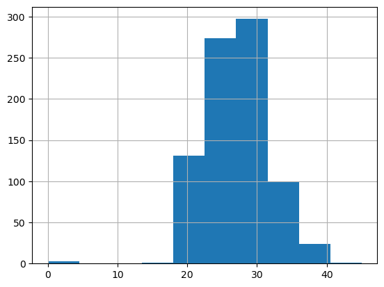
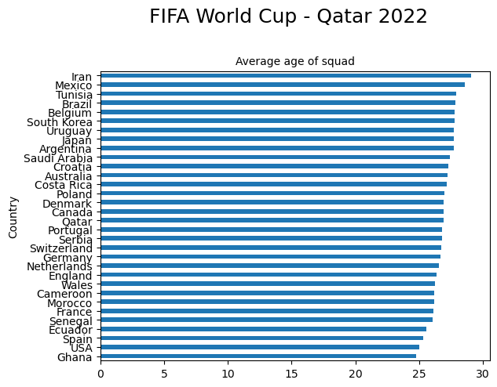
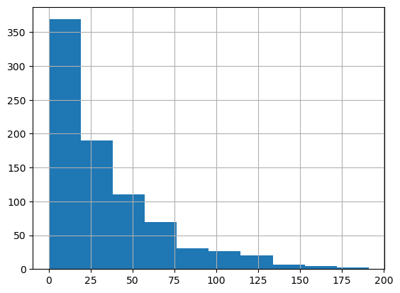
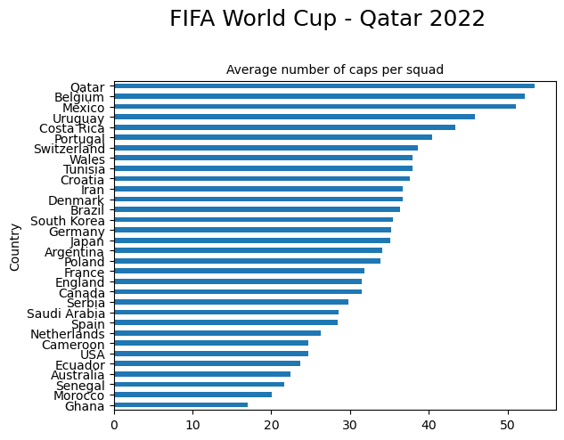
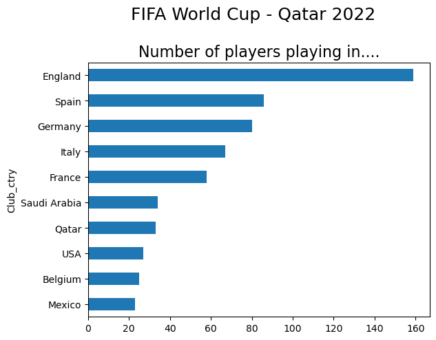
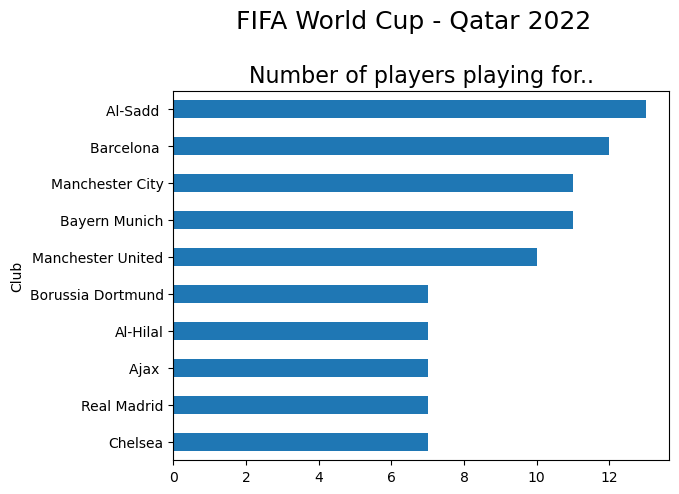
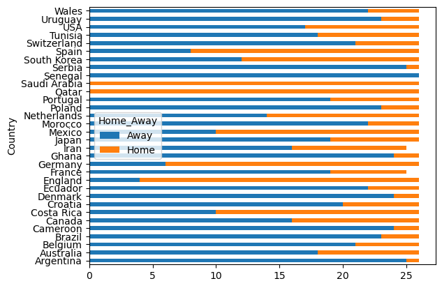
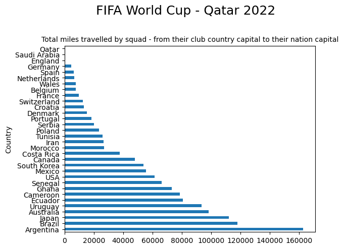

# FIFA World Cup - Qatar 2022

At the time of writing the 2022 World Cup is already underway, with 32 teams battling it out in Qatar for the famous golden globe. I've lost touch a bit in recent years with football, and thought it would be interesting to use Python to get back up to speed. 

The main aim of this project is to try and uncover some insights about the 32 teams - who has played it safe, and gone for experience, who has been bold and decided to give youth a chance to flourish. I'm also interested in where the players play their football at club level, and hope to quantify their geographical spread.

## Data source

The data was sourced from [Sporting News](https://www.sportingnews.com/us/soccer/news/world-cup-squads-2022-team-rosters-official-fifa-qatar/kjcagctfesjt0zpjxctbdqha) website.

## Exploratory Data Analysis

Let's dive in! 


```python
## Import the required packages
import pandas as pd
import numpy as np
from pathlib import Path
import matplotlib as plt

pd.options.display.float_format = '{:.2f}'.format
```


```python
# Load in our data
world_cup = pd.read_csv('Data/World_Cup_2022.csv')
```

We can automate some of the exploratory data analysis by writing a function:


```python
def initial_eda(df):
    if isinstance(df, pd.DataFrame):
        total_na = df.isna().sum().sum()
        print("Dimensions : %d rows, %d columns" % (df.shape[0], df.shape[1]))
        print("Total NA Values : %d " % (total_na))
        print("%38s %10s     %10s %10s" % ("Column Name", "Data Type", "#Distinct", "NA Values"))
        col_name = df.columns
        dtyp = df.dtypes
        uniq = df.nunique()
        na_val = df.isna().sum()
        for i in range(len(df.columns)):
            print("%38s %10s   %10s %10s" % (col_name[i], dtyp[i], uniq[i], na_val[i]))
        
    else:
        print("Expect a DataFrame but got a %15s" % (type(df)))  
```


```python
initial_eda(world_cup)
```

    Dimensions : 830 rows, 11 columns
    Total NA Values : 0 
                               Column Name  Data Type      #Distinct  NA Values
                                      Name     object          830          0
                                  Position     object            4          0
                                       Age    float64           29          0
                                   Country     object           32          0
                                  Ctry_cap     object           32          0
                                      Caps      int64          132          0
                                     Group     object            8          0
                                      Club     object          446          0
                                 Club_ctry     object           43          0
                             Club_ctry_cap     object           43          0
                                 Home_Away     object            2          0


Looks like there is no missing data within the dataset. However, there are 8 groups of 4, so 32 teams competing and the maximum permitted squad size is 26, which would be 832 players. We only have 830 observations. Let's investigate this by grouping the squad numbers by country:


```python
world_cup.groupby("Country")["Name"].count().sort_values(ascending=False)
```


    Country
    Argentina       26
    Australia       26
    Uruguay         26
    USA             26
    Tunisia         26
    Switzerland     26
    Spain           26
    South Korea     26
    Serbia          26
    Senegal         26
    Saudi Arabia    26
    Qatar           26
    Portugal        26
    Poland          26
    Netherlands     26
    Morocco         26
    Mexico          26
    Japan           26
    Ghana           26
    Germany         26
    England         26
    Ecuador         26
    Denmark         26
    Croatia         26
    Costa Rica      26
    Canada          26
    Cameroon        26
    Brazil          26
    Belgium         26
    Wales           26
    Iran            25
    France          25
    Name: Name, dtype: int64


Iran and France only have 25 players in their squad. On follow up this was confirmed to be correct, so we haven't lost any players! Let's move on and take a closer look at our data by looking at the first few rows:


```python
# View the first 5 rows
world_cup.head()
```


<div>
<style scoped>
    .dataframe tbody tr th:only-of-type {
        vertical-align: middle;
    }

    .dataframe tbody tr th {
        vertical-align: top;
    }

    .dataframe thead th {
        text-align: right;
    }
</style>
<table border="1" class="dataframe">
  <thead>
    <tr style="text-align: right;">
      <th></th>
      <th>Name</th>
      <th>Position</th>
      <th>Age</th>
      <th>Country</th>
      <th>Ctry_cap</th>
      <th>Caps</th>
      <th>Group</th>
      <th>Club</th>
      <th>Club_ctry</th>
      <th>Club_ctry_cap</th>
      <th>Home_Away</th>
    </tr>
  </thead>
  <tbody>
    <tr>
      <th>0</th>
      <td>Saad Al-Sheeb</td>
      <td>GK</td>
      <td>32.00</td>
      <td>Qatar</td>
      <td>Doha</td>
      <td>80</td>
      <td>A</td>
      <td>Al-Sadd</td>
      <td>Qatar</td>
      <td>Doha</td>
      <td>Home</td>
    </tr>
    <tr>
      <th>1</th>
      <td>Meshaal Barsham</td>
      <td>GK</td>
      <td>24.00</td>
      <td>Qatar</td>
      <td>Doha</td>
      <td>15</td>
      <td>A</td>
      <td>Al-Sadd</td>
      <td>Qatar</td>
      <td>Doha</td>
      <td>Home</td>
    </tr>
    <tr>
      <th>2</th>
      <td>Yousuf Hassan</td>
      <td>GK</td>
      <td>26.00</td>
      <td>Qatar</td>
      <td>Doha</td>
      <td>9</td>
      <td>A</td>
      <td>Al-Gharafa</td>
      <td>Qatar</td>
      <td>Doha</td>
      <td>Home</td>
    </tr>
    <tr>
      <th>3</th>
      <td>Pedro Miguel</td>
      <td>DEF</td>
      <td>32.00</td>
      <td>Qatar</td>
      <td>Doha</td>
      <td>78</td>
      <td>A</td>
      <td>Al-Sadd</td>
      <td>Qatar</td>
      <td>Doha</td>
      <td>Home</td>
    </tr>
    <tr>
      <th>4</th>
      <td>Musaab Khidir</td>
      <td>DEF</td>
      <td>29.00</td>
      <td>Qatar</td>
      <td>Doha</td>
      <td>29</td>
      <td>A</td>
      <td>Al-Sadd</td>
      <td>Qatar</td>
      <td>Doha</td>
      <td>Home</td>
    </tr>
  </tbody>
</table>
</div>


....and the last few rows:


```python
# View the last 5 rows
world_cup.tail()
```


<div>
<style scoped>
    .dataframe tbody tr th:only-of-type {
        vertical-align: middle;
    }

    .dataframe tbody tr th {
        vertical-align: top;
    }

    .dataframe thead th {
        text-align: right;
    }
</style>
<table border="1" class="dataframe">
  <thead>
    <tr style="text-align: right;">
      <th></th>
      <th>Name</th>
      <th>Position</th>
      <th>Age</th>
      <th>Country</th>
      <th>Ctry_cap</th>
      <th>Caps</th>
      <th>Group</th>
      <th>Club</th>
      <th>Club_ctry</th>
      <th>Club_ctry_cap</th>
      <th>Home_Away</th>
    </tr>
  </thead>
  <tbody>
    <tr>
      <th>825</th>
      <td>Kamaldeen Sulemana</td>
      <td>MID</td>
      <td>20.00</td>
      <td>Ghana</td>
      <td>Accra</td>
      <td>11</td>
      <td>H</td>
      <td>Stade Rennes</td>
      <td>France</td>
      <td>Paris</td>
      <td>Away</td>
    </tr>
    <tr>
      <th>826</th>
      <td>Antoine Semenyo</td>
      <td>FWD</td>
      <td>22.00</td>
      <td>Ghana</td>
      <td>Accra</td>
      <td>1</td>
      <td>H</td>
      <td>Bristol City</td>
      <td>England</td>
      <td>London</td>
      <td>Away</td>
    </tr>
    <tr>
      <th>827</th>
      <td>Andre Ayew</td>
      <td>FWD</td>
      <td>32.00</td>
      <td>Ghana</td>
      <td>Accra</td>
      <td>107</td>
      <td>H</td>
      <td>Al Sadd</td>
      <td>Qatar</td>
      <td>Doha</td>
      <td>Away</td>
    </tr>
    <tr>
      <th>828</th>
      <td>Jordan Ayew</td>
      <td>FWD</td>
      <td>31.00</td>
      <td>Ghana</td>
      <td>Accra</td>
      <td>82</td>
      <td>H</td>
      <td>Crystal Palace</td>
      <td>England</td>
      <td>London</td>
      <td>Away</td>
    </tr>
    <tr>
      <th>829</th>
      <td>Inaki Williams</td>
      <td>FWD</td>
      <td>28.00</td>
      <td>Ghana</td>
      <td>Accra</td>
      <td>1</td>
      <td>H</td>
      <td>Athletic Club</td>
      <td>Spain</td>
      <td>Madrid</td>
      <td>Away</td>
    </tr>
  </tbody>
</table>
</div>


OK, so we can see that we have some basic information about each player:

    - Name
    - Position (GK = Goalkeeper DEF = Defender MID = Midfielder FWD = Forward)
    - Age
    - Country they represent
    - Ctry_cap - capital of country they represent
    - Caps (Number of matches played for their country)
    - Group (32 teams divided into 8 groups A-H of 4)
    - Club (the team that pays the player's wages!)
    - Club_ctry (the location of the player's domestic team)
    - Club_ctry_cap (capital of their club country)
    - Home_Away - where they play their club football

## Numeric features


```python
import numpy as np

world_cup.describe(include=(np.number))
```


<div>
<style scoped>
    .dataframe tbody tr th:only-of-type {
        vertical-align: middle;
    }

    .dataframe tbody tr th {
        vertical-align: top;
    }

    .dataframe thead th {
        text-align: right;
    }
</style>
<table border="1" class="dataframe">
  <thead>
    <tr style="text-align: right;">
      <th></th>
      <th>Age</th>
      <th>Caps</th>
    </tr>
  </thead>
  <tbody>
    <tr>
      <th>count</th>
      <td>830.00</td>
      <td>830.00</td>
    </tr>
    <tr>
      <th>mean</th>
      <td>26.80</td>
      <td>33.87</td>
    </tr>
    <tr>
      <th>std</th>
      <td>4.59</td>
      <td>33.81</td>
    </tr>
    <tr>
      <th>min</th>
      <td>0.00</td>
      <td>0.00</td>
    </tr>
    <tr>
      <th>25%</th>
      <td>24.00</td>
      <td>8.00</td>
    </tr>
    <tr>
      <th>50%</th>
      <td>27.00</td>
      <td>23.00</td>
    </tr>
    <tr>
      <th>75%</th>
      <td>30.00</td>
      <td>47.00</td>
    </tr>
    <tr>
      <th>max</th>
      <td>45.00</td>
      <td>191.00</td>
    </tr>
  </tbody>
</table>
</div>


## You can't win anything with kids

<div>

</div>

It turned out of course that Alan was wrong - Manchester United went on to win the English Premier league that season. There is no master recipe for success it seems at these tournaments. Some managers like to lean on the old guard, some like to throw the gauntlet down and give the kids a chance. Let's take a look at the age profile of the players using a [***histogram***](https://en.wikipedia.org/wiki/Histogram):


```python
world_cup ['Age'].hist();
```


    

    


Something doesn't look right here, some ages between 0 and 5! Let's look into this. We can use  [.loc](https://pandas.pydata.org/docs/reference/api/pandas.DataFrame.loc.html) to *access* a group of rows and columns by name or [.iloc](https://pandas.pydata.org/pandas-docs/stable/reference/api/pandas.DataFrame.iloc.html) to access by index:


```python
world_cup.loc[world_cup['Age'] <5 ]
```


<div>
<style scoped>
    .dataframe tbody tr th:only-of-type {
        vertical-align: middle;
    }

    .dataframe tbody tr th {
        vertical-align: top;
    }

    .dataframe thead th {
        text-align: right;
    }
</style>
<table border="1" class="dataframe">
  <thead>
    <tr style="text-align: right;">
      <th></th>
      <th>Name</th>
      <th>Position</th>
      <th>Age</th>
      <th>Country</th>
      <th>Ctry_cap</th>
      <th>Caps</th>
      <th>Group</th>
      <th>Club</th>
      <th>Club_ctry</th>
      <th>Club_ctry_cap</th>
      <th>Home_Away</th>
    </tr>
  </thead>
  <tbody>
    <tr>
      <th>34</th>
      <td>Diego Palacios</td>
      <td>DEF</td>
      <td>2.00</td>
      <td>Ecuador</td>
      <td>Quito</td>
      <td>11</td>
      <td>A</td>
      <td>LAFC</td>
      <td>USA</td>
      <td>Washington, DC</td>
      <td>Away</td>
    </tr>
    <tr>
      <th>520</th>
      <td>Ahmed Reda Tagnaouti</td>
      <td>GK</td>
      <td>3.00</td>
      <td>Morocco</td>
      <td>Rabat</td>
      <td>3</td>
      <td>F</td>
      <td>Wydad Casablanca</td>
      <td>Morocco</td>
      <td>Rabat</td>
      <td>Home</td>
    </tr>
    <tr>
      <th>642</th>
      <td>Fabian Rieder</td>
      <td>MID</td>
      <td>0.00</td>
      <td>Switzerland</td>
      <td>Berne</td>
      <td>0</td>
      <td>G</td>
      <td>Young Boys</td>
      <td>Switzerland</td>
      <td>Berne</td>
      <td>Home</td>
    </tr>
  </tbody>
</table>
</div>


On follow up, Diego Palacios Fabian Redier is 23, Ahmed Reda Tagnaouti is 26, and Fabian Rieder is 20 years old. We can correct these errors using [.iat](https://pandas.pydata.org/docs/reference/api/pandas.DataFrame.iat.html). The values we wish to update are located at rows 34, 520 and 642 of column 2 - watch out, indexing starts at 0 in Python! 


```python
# Update Diego Palacios age
world_cup.iat[34,2]=23

# Update Ahmed Reda Tagnaouti age
world_cup.iat[520,2]=26

# Update Fabian Rieder age
world_cup.iat[642,2]=20
```

Let's check that's worked:


```python
world_cup.loc[34:34]
```


<div>
<style scoped>
    .dataframe tbody tr th:only-of-type {
        vertical-align: middle;
    }

    .dataframe tbody tr th {
        vertical-align: top;
    }

    .dataframe thead th {
        text-align: right;
    }
</style>
<table border="1" class="dataframe">
  <thead>
    <tr style="text-align: right;">
      <th></th>
      <th>Name</th>
      <th>Position</th>
      <th>Age</th>
      <th>Country</th>
      <th>Ctry_cap</th>
      <th>Caps</th>
      <th>Group</th>
      <th>Club</th>
      <th>Club_ctry</th>
      <th>Club_ctry_cap</th>
      <th>Home_Away</th>
    </tr>
  </thead>
  <tbody>
    <tr>
      <th>34</th>
      <td>Diego Palacios</td>
      <td>DEF</td>
      <td>23.00</td>
      <td>Ecuador</td>
      <td>Quito</td>
      <td>11</td>
      <td>A</td>
      <td>LAFC</td>
      <td>USA</td>
      <td>Washington, DC</td>
      <td>Away</td>
    </tr>
  </tbody>
</table>
</div>


```python
world_cup.loc[520:520]
```


<div>
<style scoped>
    .dataframe tbody tr th:only-of-type {
        vertical-align: middle;
    }

    .dataframe tbody tr th {
        vertical-align: top;
    }

    .dataframe thead th {
        text-align: right;
    }
</style>
<table border="1" class="dataframe">
  <thead>
    <tr style="text-align: right;">
      <th></th>
      <th>Name</th>
      <th>Position</th>
      <th>Age</th>
      <th>Country</th>
      <th>Ctry_cap</th>
      <th>Caps</th>
      <th>Group</th>
      <th>Club</th>
      <th>Club_ctry</th>
      <th>Club_ctry_cap</th>
      <th>Home_Away</th>
    </tr>
  </thead>
  <tbody>
    <tr>
      <th>520</th>
      <td>Ahmed Reda Tagnaouti</td>
      <td>GK</td>
      <td>26.00</td>
      <td>Morocco</td>
      <td>Rabat</td>
      <td>3</td>
      <td>F</td>
      <td>Wydad Casablanca</td>
      <td>Morocco</td>
      <td>Rabat</td>
      <td>Home</td>
    </tr>
  </tbody>
</table>
</div>


```python
world_cup.loc[642:642]
```


<div>
<style scoped>
    .dataframe tbody tr th:only-of-type {
        vertical-align: middle;
    }

    .dataframe tbody tr th {
        vertical-align: top;
    }

    .dataframe thead th {
        text-align: right;
    }
</style>
<table border="1" class="dataframe">
  <thead>
    <tr style="text-align: right;">
      <th></th>
      <th>Name</th>
      <th>Position</th>
      <th>Age</th>
      <th>Country</th>
      <th>Ctry_cap</th>
      <th>Caps</th>
      <th>Group</th>
      <th>Club</th>
      <th>Club_ctry</th>
      <th>Club_ctry_cap</th>
      <th>Home_Away</th>
    </tr>
  </thead>
  <tbody>
    <tr>
      <th>642</th>
      <td>Fabian Rieder</td>
      <td>MID</td>
      <td>20.00</td>
      <td>Switzerland</td>
      <td>Berne</td>
      <td>0</td>
      <td>G</td>
      <td>Young Boys</td>
      <td>Switzerland</td>
      <td>Berne</td>
      <td>Home</td>
    </tr>
  </tbody>
</table>
</div>


Great, the ages have been successfully updated. Let's now take a look at the age profile of each of the 32 squads:


```python
import matplotlib.pyplot as plt

title_string = "FIFA World Cup - Qatar 2022"
subtitle_string = "Average age of squad"

x = world_cup.groupby('Country')['Age'].mean().sort_values()
plt.figure()
x.plot(kind='barh')
plt.suptitle(title_string, y=1.05, fontsize=18)
plt.title(subtitle_string, fontsize=10)

```


    Text(0.5, 1.0, 'Average age of squad')


    

    


```python
ave_age = world_cup.groupby("Country")["Age"].mean()
ave_age.sort_values(ascending=False)
```


    Country
    Iran           29.08
    Mexico         28.58
    Tunisia        27.92
    Brazil         27.86
    Belgium        27.77
    South Korea    27.77
    Uruguay        27.73
    Japan          27.69
    Argentina      27.69
    Saudi Arabia   27.38
    Croatia        27.31
    Australia      27.23
    Costa Rica     27.15
    Poland         27.00
    Canada         26.92
    Denmark        26.92
    Qatar          26.92
    Portugal       26.77
    Serbia         26.77
    Switzerland    26.73
    Germany        26.69
    Netherlands    26.58
    England        26.35
    Wales          26.23
    Morocco        26.19
    Cameroon       26.19
    France         26.12
    Senegal        26.04
    Ecuador        25.54
    Spain          25.31
    USA            25.00
    Ghana          24.73
    Name: Age, dtype: float64


So Ghana and Ecaudor have the youngest squads (average age 24.73) whilst Iran has the oldest, with an average age of 29.08. 

## Out with the old

<div>

</div>


The players below will be looking at the board and hoping for a large number. Players are looking after themselves more and more, extending their playing careers, but realistically, for the players below, this is possibly their last opportunity to appear in a World Cup. So make sure to see catch them while you can!


```python
mature = world_cup[world_cup['Age'] > 33]
mature_sorted = mature.sort_values(by="Age",ascending = False)
mature_sorted.head(10)
```


<div>
<style scoped>
    .dataframe tbody tr th:only-of-type {
        vertical-align: middle;
    }

    .dataframe tbody tr th {
        vertical-align: top;
    }

    .dataframe thead th {
        text-align: right;
    }
</style>
<table border="1" class="dataframe">
  <thead>
    <tr style="text-align: right;">
      <th></th>
      <th>Name</th>
      <th>Position</th>
      <th>Age</th>
      <th>Country</th>
      <th>Ctry_cap</th>
      <th>Caps</th>
      <th>Group</th>
      <th>Club</th>
      <th>Club_ctry</th>
      <th>Club_ctry_cap</th>
      <th>Home_Away</th>
    </tr>
  </thead>
  <tbody>
    <tr>
      <th>143</th>
      <td>Ramin Rezaeian</td>
      <td>DEF</td>
      <td>45.00</td>
      <td>Iran</td>
      <td>Tehran</td>
      <td>2</td>
      <td>B</td>
      <td>Sepahan</td>
      <td>Iran</td>
      <td>Tehran</td>
      <td>Home</td>
    </tr>
    <tr>
      <th>261</th>
      <td>Alfredo Talavera</td>
      <td>GK</td>
      <td>40.00</td>
      <td>Mexico</td>
      <td>Mexico City</td>
      <td>40</td>
      <td>C</td>
      <td>FC Juarez</td>
      <td>Mexico</td>
      <td>Mexico City</td>
      <td>Home</td>
    </tr>
    <tr>
      <th>440</th>
      <td>Eiji Kawashima</td>
      <td>GK</td>
      <td>39.00</td>
      <td>Japan</td>
      <td>Tokyo</td>
      <td>95</td>
      <td>E</td>
      <td>Strasbourg</td>
      <td>France</td>
      <td>Paris</td>
      <td>Away</td>
    </tr>
    <tr>
      <th>781</th>
      <td>Pepe</td>
      <td>DEF</td>
      <td>39.00</td>
      <td>Portugal</td>
      <td>Lisbon</td>
      <td>128</td>
      <td>H</td>
      <td>Porto</td>
      <td>Portugal</td>
      <td>Lisbon</td>
      <td>Home</td>
    </tr>
    <tr>
      <th>608</th>
      <td>Atiba Hutchinson</td>
      <td>MID</td>
      <td>39.00</td>
      <td>Canada</td>
      <td>Ottawa</td>
      <td>98</td>
      <td>F</td>
      <td>Besiktas</td>
      <td>Turkey</td>
      <td>Istanbul</td>
      <td>Away</td>
    </tr>
    <tr>
      <th>682</th>
      <td>Dani Alves</td>
      <td>DEF</td>
      <td>39.00</td>
      <td>Brazil</td>
      <td>Brasilia</td>
      <td>125</td>
      <td>G</td>
      <td>Pumas UNAM</td>
      <td>Mexico</td>
      <td>Mexico City</td>
      <td>Away</td>
    </tr>
    <tr>
      <th>679</th>
      <td>Thiago Silva</td>
      <td>DEF</td>
      <td>38.00</td>
      <td>Brazil</td>
      <td>Brasilia</td>
      <td>108</td>
      <td>G</td>
      <td>Chelsea</td>
      <td>England</td>
      <td>London</td>
      <td>Away</td>
    </tr>
    <tr>
      <th>78</th>
      <td>Remko Pasveer</td>
      <td>GK</td>
      <td>38.00</td>
      <td>Netherlands</td>
      <td>Amsterdam</td>
      <td>2</td>
      <td>A</td>
      <td>Ajax</td>
      <td>Netherlands</td>
      <td>Amsterdam</td>
      <td>Home</td>
    </tr>
    <tr>
      <th>340</th>
      <td>Aymen Mathlouthi</td>
      <td>GK</td>
      <td>38.00</td>
      <td>Tunisia</td>
      <td>Tunis</td>
      <td>73</td>
      <td>D</td>
      <td>Etoile du Sahel</td>
      <td>Tunisia</td>
      <td>Tunis</td>
      <td>Home</td>
    </tr>
    <tr>
      <th>365</th>
      <td>Steve Mandanda</td>
      <td>GK</td>
      <td>37.00</td>
      <td>France</td>
      <td>Paris</td>
      <td>34</td>
      <td>D</td>
      <td>Rennes</td>
      <td>France</td>
      <td>Paris</td>
      <td>Home</td>
    </tr>
  </tbody>
</table>
</div>


## In with the new


```python
new = world_cup[world_cup['Age'] < 20]
new_sorted = new.sort_values(by="Age",ascending = True)
new_sorted.head(10)
```


<div>
<style scoped>
    .dataframe tbody tr th:only-of-type {
        vertical-align: middle;
    }

    .dataframe tbody tr th {
        vertical-align: top;
    }

    .dataframe thead th {
        text-align: right;
    }
</style>
<table border="1" class="dataframe">
  <thead>
    <tr style="text-align: right;">
      <th></th>
      <th>Name</th>
      <th>Position</th>
      <th>Age</th>
      <th>Country</th>
      <th>Ctry_cap</th>
      <th>Caps</th>
      <th>Group</th>
      <th>Club</th>
      <th>Club_ctry</th>
      <th>Club_ctry_cap</th>
      <th>Home_Away</th>
    </tr>
  </thead>
  <tbody>
    <tr>
      <th>435</th>
      <td>Youssoufa Moukoko</td>
      <td>FWD</td>
      <td>17.00</td>
      <td>Germany</td>
      <td>Berlin</td>
      <td>1</td>
      <td>E</td>
      <td>Borussia Dortmund</td>
      <td>Germany</td>
      <td>Berlin</td>
      <td>Home</td>
    </tr>
    <tr>
      <th>820</th>
      <td>Fatawu Issahaku</td>
      <td>MID</td>
      <td>18.00</td>
      <td>Ghana</td>
      <td>Accra</td>
      <td>11</td>
      <td>H</td>
      <td>Sporting</td>
      <td>Portugal</td>
      <td>Lisbon</td>
      <td>Away</td>
    </tr>
    <tr>
      <th>577</th>
      <td>Zeno Debast</td>
      <td>DEF</td>
      <td>18.00</td>
      <td>Belgium</td>
      <td>Brussels</td>
      <td>3</td>
      <td>F</td>
      <td>Anderlecht</td>
      <td>Belgium</td>
      <td>Brussels</td>
      <td>Home</td>
    </tr>
    <tr>
      <th>531</th>
      <td>Bilal El Khannouss</td>
      <td>MID</td>
      <td>18.00</td>
      <td>Morocco</td>
      <td>Rabat</td>
      <td>0</td>
      <td>F</td>
      <td>Racing Genk</td>
      <td>Belgium</td>
      <td>Brussels</td>
      <td>Away</td>
    </tr>
    <tr>
      <th>505</th>
      <td>Jewison Bennette</td>
      <td>MID</td>
      <td>18.00</td>
      <td>Costa Rica</td>
      <td>San Jose</td>
      <td>7</td>
      <td>E</td>
      <td>Sunderland</td>
      <td>England</td>
      <td>London</td>
      <td>Away</td>
    </tr>
    <tr>
      <th>412</th>
      <td>Garang Kuol</td>
      <td>FWD</td>
      <td>18.00</td>
      <td>Australia</td>
      <td>Canberra</td>
      <td>1</td>
      <td>D</td>
      <td>Central Coast Mariners</td>
      <td>Australia</td>
      <td>Canberra</td>
      <td>Home</td>
    </tr>
    <tr>
      <th>478</th>
      <td>Gavi</td>
      <td>MID</td>
      <td>18.00</td>
      <td>Spain</td>
      <td>Madrid</td>
      <td>13</td>
      <td>E</td>
      <td>Barcelona</td>
      <td>Spain</td>
      <td>Madrid</td>
      <td>Home</td>
    </tr>
    <tr>
      <th>784</th>
      <td>Antonio Silva</td>
      <td>DEF</td>
      <td>19.00</td>
      <td>Portugal</td>
      <td>Lisbon</td>
      <td>0</td>
      <td>H</td>
      <td>Benfica</td>
      <td>Portugal</td>
      <td>Lisbon</td>
      <td>Home</td>
    </tr>
    <tr>
      <th>648</th>
      <td>Simon Ngapandouetnbu</td>
      <td>GK</td>
      <td>19.00</td>
      <td>Cameroon</td>
      <td>Yaounde</td>
      <td>0</td>
      <td>G</td>
      <td>Marseille</td>
      <td>France</td>
      <td>Paris</td>
      <td>Away</td>
    </tr>
    <tr>
      <th>504</th>
      <td>Brandon Aguilera</td>
      <td>MID</td>
      <td>19.00</td>
      <td>Costa Rica</td>
      <td>San Jose</td>
      <td>4</td>
      <td>E</td>
      <td>Guanacasteca</td>
      <td>Costa Rica</td>
      <td>San Jose</td>
      <td>Home</td>
    </tr>
  </tbody>
</table>
</div>


So it looks like the youngest player at the tournament is Youssoufa Moukoko of Germany at just 17. 

## Are you experienced?


Although in some sports physical caps may not now always be given (whether at all or for each appearance) the term cap for an international or other appearance has been retained as an indicator of the number of occasions on which a sportsperson has represented a team in a particular sport. Thus, a "cap" is awarded for each game played and so a player who has played x games for the team is said to have been capped x times or have won x caps.

Let's first look at the distribution of the number of caps received going into this tournament, using a [***histogram***](https://en.wikipedia.org/wiki/Histogram):


```python
world_cup ['Caps'].hist();
```


    

    


As we can see the majority of players are relatively inexperienced, with less than around 40 appearances, although there are some very experienced players, with over 150 caps. Let's have a look at who they are:


```python
world_cup.loc[world_cup['Caps'] > 150]
```


<div>
<style scoped>
    .dataframe tbody tr th:only-of-type {
        vertical-align: middle;
    }

    .dataframe tbody tr th {
        vertical-align: top;
    }

    .dataframe thead th {
        text-align: right;
    }
</style>
<table border="1" class="dataframe">
  <thead>
    <tr style="text-align: right;">
      <th></th>
      <th>Name</th>
      <th>Position</th>
      <th>Age</th>
      <th>Country</th>
      <th>Ctry_cap</th>
      <th>Caps</th>
      <th>Group</th>
      <th>Club</th>
      <th>Club_ctry</th>
      <th>Club_ctry_cap</th>
      <th>Home_Away</th>
    </tr>
  </thead>
  <tbody>
    <tr>
      <th>20</th>
      <td>Hassan Al-Haydos</td>
      <td>MID</td>
      <td>31.00</td>
      <td>Qatar</td>
      <td>Doha</td>
      <td>160</td>
      <td>A</td>
      <td>Al-Sadd</td>
      <td>Qatar</td>
      <td>Doha</td>
      <td>Home</td>
    </tr>
    <tr>
      <th>232</th>
      <td>Lionel Messi</td>
      <td>FWD</td>
      <td>35.00</td>
      <td>Argentina</td>
      <td>Buenos Aires</td>
      <td>165</td>
      <td>C</td>
      <td>PSG</td>
      <td>France</td>
      <td>Paris</td>
      <td>Away</td>
    </tr>
    <tr>
      <th>272</th>
      <td>Andres Guardado</td>
      <td>MID</td>
      <td>36.00</td>
      <td>Mexico</td>
      <td>Mexico City</td>
      <td>180</td>
      <td>C</td>
      <td>Real Betis</td>
      <td>Spain</td>
      <td>Madrid</td>
      <td>Away</td>
    </tr>
    <tr>
      <th>506</th>
      <td>Celso Borges</td>
      <td>MID</td>
      <td>34.00</td>
      <td>Costa Rica</td>
      <td>San Jose</td>
      <td>154</td>
      <td>E</td>
      <td>Alajuelense</td>
      <td>Costa Rica</td>
      <td>San Jose</td>
      <td>Home</td>
    </tr>
    <tr>
      <th>558</th>
      <td>Luka Modric</td>
      <td>MID</td>
      <td>37.00</td>
      <td>Croatia</td>
      <td>Zagreb</td>
      <td>155</td>
      <td>F</td>
      <td>Real Madrid</td>
      <td>Spain</td>
      <td>Madrid</td>
      <td>Away</td>
    </tr>
    <tr>
      <th>733</th>
      <td>Diego Godin</td>
      <td>DEF</td>
      <td>36.00</td>
      <td>Uruguay</td>
      <td>Montevideo</td>
      <td>159</td>
      <td>G</td>
      <td>Velez Sarsfield</td>
      <td>Argentina</td>
      <td>Buenos Aires</td>
      <td>Away</td>
    </tr>
    <tr>
      <th>798</th>
      <td>Cristiano Ronaldo</td>
      <td>FWD</td>
      <td>37.00</td>
      <td>Portugal</td>
      <td>Lisbon</td>
      <td>191</td>
      <td>H</td>
      <td>Manchester United</td>
      <td>England</td>
      <td>London</td>
      <td>Away</td>
    </tr>
  </tbody>
</table>
</div>


Cristiano Ronaldo is the most capped player at the tournament with 191. The 200 mark is in sight, although at 37 maybe it's time to make way for some new blood?

## Baptism of fire?

<div>

</div>


The minimum number of caps shown is 0 which means there are players at this tournament who have yet to play for their country - the stage has been set! Let's find out who they are:


```python
world_cup.loc[world_cup['Caps'] == 0]
```


<div>
<style scoped>
    .dataframe tbody tr th:only-of-type {
        vertical-align: middle;
    }

    .dataframe tbody tr th {
        vertical-align: top;
    }

    .dataframe thead th {
        text-align: right;
    }
</style>
<table border="1" class="dataframe">
  <thead>
    <tr style="text-align: right;">
      <th></th>
      <th>Name</th>
      <th>Position</th>
      <th>Age</th>
      <th>Country</th>
      <th>Ctry_cap</th>
      <th>Caps</th>
      <th>Group</th>
      <th>Club</th>
      <th>Club_ctry</th>
      <th>Club_ctry_cap</th>
      <th>Home_Away</th>
    </tr>
  </thead>
  <tbody>
    <tr>
      <th>12</th>
      <td>Jassim Jabir</td>
      <td>MID</td>
      <td>20.00</td>
      <td>Qatar</td>
      <td>Doha</td>
      <td>0</td>
      <td>A</td>
      <td>Al-Arabi</td>
      <td>Qatar</td>
      <td>Doha</td>
      <td>Home</td>
    </tr>
    <tr>
      <th>33</th>
      <td>William Pacho</td>
      <td>DEF</td>
      <td>21.00</td>
      <td>Ecuador</td>
      <td>Quito</td>
      <td>0</td>
      <td>A</td>
      <td>Royal Antwerp</td>
      <td>Belgium</td>
      <td>Brussels</td>
      <td>Away</td>
    </tr>
    <tr>
      <th>50</th>
      <td>Kevin Rodriguez</td>
      <td>FWD</td>
      <td>22.00</td>
      <td>Ecuador</td>
      <td>Quito</td>
      <td>0</td>
      <td>A</td>
      <td>Imbabura SC</td>
      <td>Ecuador</td>
      <td>Quito</td>
      <td>Home</td>
    </tr>
    <tr>
      <th>61</th>
      <td>Moussa Ndiaye</td>
      <td>DEF</td>
      <td>20.00</td>
      <td>Senegal</td>
      <td>Dakar</td>
      <td>0</td>
      <td>A</td>
      <td>Anderlecht</td>
      <td>Belgium</td>
      <td>Brussels</td>
      <td>Away</td>
    </tr>
    <tr>
      <th>70</th>
      <td>Pathe Ciss</td>
      <td>MID</td>
      <td>28.00</td>
      <td>Senegal</td>
      <td>Dakar</td>
      <td>0</td>
      <td>A</td>
      <td>Rayo Vallecano</td>
      <td>Spain</td>
      <td>Madrid</td>
      <td>Away</td>
    </tr>
    <tr>
      <th>79</th>
      <td>Andries Noppert</td>
      <td>GK</td>
      <td>28.00</td>
      <td>Netherlands</td>
      <td>Amsterdam</td>
      <td>0</td>
      <td>A</td>
      <td>Heerenveen</td>
      <td>Netherlands</td>
      <td>Amsterdam</td>
      <td>Home</td>
    </tr>
    <tr>
      <th>83</th>
      <td>Jeremie Frimpong</td>
      <td>DEF</td>
      <td>21.00</td>
      <td>Netherlands</td>
      <td>Amsterdam</td>
      <td>0</td>
      <td>A</td>
      <td>Bayer Leverkusen</td>
      <td>Germany</td>
      <td>Berlin</td>
      <td>Away</td>
    </tr>
    <tr>
      <th>92</th>
      <td>Xavi Simons</td>
      <td>MID</td>
      <td>19.00</td>
      <td>Netherlands</td>
      <td>Amsterdam</td>
      <td>0</td>
      <td>A</td>
      <td>PSV Eindhoven</td>
      <td>Netherlands</td>
      <td>Amsterdam</td>
      <td>Home</td>
    </tr>
    <tr>
      <th>234</th>
      <td>Nawaf Al-Aqidi</td>
      <td>GK</td>
      <td>22.00</td>
      <td>Saudi Arabia</td>
      <td>Riyadh</td>
      <td>0</td>
      <td>C</td>
      <td>Al-Nassr FC</td>
      <td>Saudi Arabia</td>
      <td>Riyadh</td>
      <td>Home</td>
    </tr>
    <tr>
      <th>235</th>
      <td>Mohamed Al-Yami</td>
      <td>GK</td>
      <td>25.00</td>
      <td>Saudi Arabia</td>
      <td>Riyadh</td>
      <td>0</td>
      <td>C</td>
      <td>Al-Ahli Saudi FC</td>
      <td>Saudi Arabia</td>
      <td>Riyadh</td>
      <td>Home</td>
    </tr>
    <tr>
      <th>366</th>
      <td>Axel Disasi</td>
      <td>DEF</td>
      <td>24.00</td>
      <td>France</td>
      <td>Paris</td>
      <td>0</td>
      <td>D</td>
      <td>Monaco</td>
      <td>France</td>
      <td>Paris</td>
      <td>Home</td>
    </tr>
    <tr>
      <th>474</th>
      <td>Alejandro Balde</td>
      <td>DEF</td>
      <td>19.00</td>
      <td>Spain</td>
      <td>Madrid</td>
      <td>0</td>
      <td>E</td>
      <td>Barcelona</td>
      <td>Spain</td>
      <td>Madrid</td>
      <td>Home</td>
    </tr>
    <tr>
      <th>531</th>
      <td>Bilal El Khannouss</td>
      <td>MID</td>
      <td>18.00</td>
      <td>Morocco</td>
      <td>Rabat</td>
      <td>0</td>
      <td>F</td>
      <td>Racing Genk</td>
      <td>Belgium</td>
      <td>Brussels</td>
      <td>Away</td>
    </tr>
    <tr>
      <th>597</th>
      <td>James Pantemis</td>
      <td>GK</td>
      <td>25.00</td>
      <td>Canada</td>
      <td>Ottawa</td>
      <td>0</td>
      <td>F</td>
      <td>CF Montreal</td>
      <td>Canada</td>
      <td>Ottawa</td>
      <td>Home</td>
    </tr>
    <tr>
      <th>624</th>
      <td>Philipp Kohn</td>
      <td>GK</td>
      <td>24.00</td>
      <td>Switzerland</td>
      <td>Berne</td>
      <td>0</td>
      <td>G</td>
      <td>RB Salzburg</td>
      <td>Austria</td>
      <td>Vienna</td>
      <td>Away</td>
    </tr>
    <tr>
      <th>642</th>
      <td>Fabian Rieder</td>
      <td>MID</td>
      <td>20.00</td>
      <td>Switzerland</td>
      <td>Berne</td>
      <td>0</td>
      <td>G</td>
      <td>Young Boys</td>
      <td>Switzerland</td>
      <td>Berne</td>
      <td>Home</td>
    </tr>
    <tr>
      <th>648</th>
      <td>Simon Ngapandouetnbu</td>
      <td>GK</td>
      <td>19.00</td>
      <td>Cameroon</td>
      <td>Yaounde</td>
      <td>0</td>
      <td>G</td>
      <td>Marseille</td>
      <td>France</td>
      <td>Paris</td>
      <td>Away</td>
    </tr>
    <tr>
      <th>779</th>
      <td>Jose Sa</td>
      <td>GK</td>
      <td>29.00</td>
      <td>Portugal</td>
      <td>Lisbon</td>
      <td>0</td>
      <td>H</td>
      <td>Wolves</td>
      <td>England</td>
      <td>London</td>
      <td>Away</td>
    </tr>
    <tr>
      <th>784</th>
      <td>Antonio Silva</td>
      <td>DEF</td>
      <td>19.00</td>
      <td>Portugal</td>
      <td>Lisbon</td>
      <td>0</td>
      <td>H</td>
      <td>Benfica</td>
      <td>Portugal</td>
      <td>Lisbon</td>
      <td>Home</td>
    </tr>
    <tr>
      <th>802</th>
      <td>Goncalo Ramos</td>
      <td>FWD</td>
      <td>21.00</td>
      <td>Portugal</td>
      <td>Lisbon</td>
      <td>0</td>
      <td>H</td>
      <td>Benfica</td>
      <td>Portugal</td>
      <td>Lisbon</td>
      <td>Home</td>
    </tr>
    <tr>
      <th>806</th>
      <td>Ibrahim Danlad</td>
      <td>GK</td>
      <td>19.00</td>
      <td>Ghana</td>
      <td>Accra</td>
      <td>0</td>
      <td>H</td>
      <td>Asante Kotoko</td>
      <td>Ghana</td>
      <td>Accra</td>
      <td>Home</td>
    </tr>
    <tr>
      <th>823</th>
      <td>Salis Abdul Samed</td>
      <td>MID</td>
      <td>22.00</td>
      <td>Ghana</td>
      <td>Accra</td>
      <td>0</td>
      <td>H</td>
      <td>Lens</td>
      <td>France</td>
      <td>Paris</td>
      <td>Away</td>
    </tr>
    <tr>
      <th>824</th>
      <td>Kamal Sowah</td>
      <td>MID</td>
      <td>22.00</td>
      <td>Ghana</td>
      <td>Accra</td>
      <td>0</td>
      <td>H</td>
      <td>Club Brugge</td>
      <td>Belgium</td>
      <td>Brussels</td>
      <td>Away</td>
    </tr>
  </tbody>
</table>
</div>


As expected, these players are generally quite young (although Portugal's Jose Sa is 29 - better late than never) or goalkeepers, where the first choice tends to be difficult to oust! Keep an eye out for these names - they might be the stars of the future.

Let's take a look at the average number of caps for each squad:


```python
import matplotlib.pyplot as plt

title_string = "FIFA World Cup - Qatar 2022"
subtitle_string = "Average number of caps per squad"

x = world_cup.groupby('Country')['Caps'].mean().sort_values()
plt.figure()
x.plot(kind='barh')
plt.suptitle(title_string, y=1.05, fontsize=18)
plt.title(subtitle_string, fontsize=10)
```


    Text(0.5, 1.0, 'Average number of caps per squad')


    

    


```python
caps = world_cup.groupby("Country")["Caps"].mean()
caps.sort_values(ascending=False)
```


    Country
    Qatar          53.46
    Belgium        52.19
    Mexico         51.12
    Uruguay        45.85
    Costa Rica     43.42
    Portugal       40.42
    Switzerland    38.58
    Wales          37.96
    Tunisia        37.88
    Croatia        37.65
    Iran           36.72
    Denmark        36.65
    Brazil         36.31
    South Korea    35.46
    Germany        35.19
    Japan          35.15
    Argentina      34.12
    Poland         33.88
    France         31.80
    England        31.54
    Canada         31.46
    Serbia         29.77
    Saudi Arabia   28.50
    Spain          28.42
    Netherlands    26.23
    Cameroon       24.73
    USA            24.69
    Ecuador        23.73
    Australia      22.42
    Senegal        21.62
    Morocco        20.04
    Ghana          17.00
    Name: Caps, dtype: float64


The host nation Quatar have the most experienced squad with an average of 53.46 international apperances per player. The least experienced squad is Ghana, with an average of 17. 

To caveat this, it is worth noting that qualification for the World Cup is segregated by region, and there can be a wide disparity between the number of qualifying matches played. This can result in some nations playing a large number of matches, without necessarily playing in a major tournament, which is perhaps a better indicator of experience. 

## Categorical features

Here's how we get a quick summary of all the non-numeric columns in the dataset:


```python
world_cup.describe(include=[object])
```


<div>
<style scoped>
    .dataframe tbody tr th:only-of-type {
        vertical-align: middle;
    }

    .dataframe tbody tr th {
        vertical-align: top;
    }

    .dataframe thead th {
        text-align: right;
    }
</style>
<table border="1" class="dataframe">
  <thead>
    <tr style="text-align: right;">
      <th></th>
      <th>Name</th>
      <th>Position</th>
      <th>Country</th>
      <th>Ctry_cap</th>
      <th>Group</th>
      <th>Club</th>
      <th>Club_ctry</th>
      <th>Club_ctry_cap</th>
      <th>Home_Away</th>
    </tr>
  </thead>
  <tbody>
    <tr>
      <th>count</th>
      <td>830</td>
      <td>830</td>
      <td>830</td>
      <td>830</td>
      <td>830</td>
      <td>830</td>
      <td>830</td>
      <td>830</td>
      <td>830</td>
    </tr>
    <tr>
      <th>unique</th>
      <td>830</td>
      <td>4</td>
      <td>32</td>
      <td>32</td>
      <td>8</td>
      <td>446</td>
      <td>43</td>
      <td>43</td>
      <td>2</td>
    </tr>
    <tr>
      <th>top</th>
      <td>Saad Al-Sheeb</td>
      <td>DEF</td>
      <td>Qatar</td>
      <td>Doha</td>
      <td>G</td>
      <td>Al-Sadd</td>
      <td>England</td>
      <td>London</td>
      <td>Away</td>
    </tr>
    <tr>
      <th>freq</th>
      <td>1</td>
      <td>274</td>
      <td>26</td>
      <td>26</td>
      <td>130</td>
      <td>13</td>
      <td>159</td>
      <td>159</td>
      <td>551</td>
    </tr>
  </tbody>
</table>
</div>


```python
cols = ['Position', 'Group', 'Home_Away']
world_cup[cols] = world_cup[cols].astype('category')
```


```python
world_cup[['Name','Country','Ctry_cap','Club','Club_ctry','Club_ctry_cap']] = world_cup[['Name','Country','Ctry_cap','Club','Club_ctry','Club_ctry_cap']].astype(str)
```

## Club v Country

First of all let's look at where these 830 players play their club football:


```python
import matplotlib.pyplot as plt

title_string = "FIFA World Cup - Qatar 2022"
subtitle_string = "Number of players playing in...."

x = world_cup.groupby('Club_ctry')['Club'].count().sort_values(ascending=True).tail(10)
plt.figure()
x.plot(kind='barh')
plt.suptitle(title_string, y=1.05, fontsize=18)
plt.title(subtitle_string, fontsize=16)
```


    Text(0.5, 1.0, 'Number of players playing in....')


    

    


```python
world_cup.groupby("Club_ctry")["Club"].count().sort_values(ascending=False).head(10)
```


    Club_ctry
    England         159
    Spain            86
    Germany          80
    Italy            67
    France           58
    Saudi Arabia     34
    Qatar            33
    USA              27
    Belgium          25
    Mexico           23
    Name: Club, dtype: int64


So out of 830 players represented at the World Cup, 159 play their football in England. Let's take a look at the top 10 clubs with the most players playing at this tournament: 


```python
title_string = "FIFA World Cup - Qatar 2022"
subtitle_string = "Number of players playing for.."

x = world_cup.groupby("Club")["Club_ctry"].count().sort_values(ascending=True).tail(10)
plt.figure()
x.plot(kind='barh')
plt.suptitle(title_string, y=1.05, fontsize=18)
plt.title(subtitle_string, fontsize=16)
```


    Text(0.5, 1.0, 'Number of players playing for..')


    

    


Al-Sadd, wo play in the Qatar Stars league have 13 players (all playing for Qatar) at the tournament, closely followed by Barcelona with 12, Munich and Manchester City, with 11 and Manchester United having 10. Saudi Arabia's squad all play within Saudi Arabia, 7 of them for Al_Hilal.

## Scotland

<div>

</div>


Sadly, my country didn't make it, but there are some players who play domestically in Scotland who will be in Qatar representing their country. Let's have a look and see who they are:


```python
scotland = world_cup[world_cup['Club_ctry'] == 'Scotland']
scotland
```


<div>
<style scoped>
    .dataframe tbody tr th:only-of-type {
        vertical-align: middle;
    }

    .dataframe tbody tr th {
        vertical-align: top;
    }

    .dataframe thead th {
        text-align: right;
    }
</style>
<table border="1" class="dataframe">
  <thead>
    <tr style="text-align: right;">
      <th></th>
      <th>Name</th>
      <th>Position</th>
      <th>Age</th>
      <th>Country</th>
      <th>Ctry_cap</th>
      <th>Caps</th>
      <th>Group</th>
      <th>Club</th>
      <th>Club_ctry</th>
      <th>Club_ctry_cap</th>
      <th>Home_Away</th>
    </tr>
  </thead>
  <tbody>
    <tr>
      <th>159</th>
      <td>Cameron Carter-Vickers</td>
      <td>DEF</td>
      <td>24.00</td>
      <td>USA</td>
      <td>Washington, DC</td>
      <td>10</td>
      <td>B</td>
      <td>Celtic</td>
      <td>Scotland</td>
      <td>Edinburgh</td>
      <td>Away</td>
    </tr>
    <tr>
      <th>200</th>
      <td>Dylan Levitt</td>
      <td>MID</td>
      <td>21.00</td>
      <td>Wales</td>
      <td>Cardiff</td>
      <td>13</td>
      <td>B</td>
      <td>Dundee United</td>
      <td>Scotland</td>
      <td>Edinburgh</td>
      <td>Away</td>
    </tr>
    <tr>
      <th>392</th>
      <td>Aziz Behich</td>
      <td>DEF</td>
      <td>31.00</td>
      <td>Australia</td>
      <td>Canberra</td>
      <td>53</td>
      <td>D</td>
      <td>Dundee United</td>
      <td>Scotland</td>
      <td>Edinburgh</td>
      <td>Away</td>
    </tr>
    <tr>
      <th>394</th>
      <td>Nathaniel Atkinson</td>
      <td>DEF</td>
      <td>23.00</td>
      <td>Australia</td>
      <td>Canberra</td>
      <td>5</td>
      <td>D</td>
      <td>Hearts</td>
      <td>Scotland</td>
      <td>Edinburgh</td>
      <td>Away</td>
    </tr>
    <tr>
      <th>397</th>
      <td>Kye Rowles</td>
      <td>DEF</td>
      <td>24.00</td>
      <td>Australia</td>
      <td>Canberra</td>
      <td>3</td>
      <td>D</td>
      <td>Hearts</td>
      <td>Scotland</td>
      <td>Edinburgh</td>
      <td>Away</td>
    </tr>
    <tr>
      <th>400</th>
      <td>Aaron Mooy</td>
      <td>MID</td>
      <td>32.00</td>
      <td>Australia</td>
      <td>Canberra</td>
      <td>53</td>
      <td>D</td>
      <td>Celtic</td>
      <td>Scotland</td>
      <td>Edinburgh</td>
      <td>Away</td>
    </tr>
    <tr>
      <th>403</th>
      <td>Keanu Baccus</td>
      <td>MID</td>
      <td>29.00</td>
      <td>Australia</td>
      <td>Canberra</td>
      <td>53</td>
      <td>D</td>
      <td>St Mirren</td>
      <td>Scotland</td>
      <td>Edinburgh</td>
      <td>Away</td>
    </tr>
    <tr>
      <th>404</th>
      <td>Cameron Devlin</td>
      <td>MID</td>
      <td>24.00</td>
      <td>Australia</td>
      <td>Canberra</td>
      <td>1</td>
      <td>D</td>
      <td>Hearts</td>
      <td>Scotland</td>
      <td>Edinburgh</td>
      <td>Away</td>
    </tr>
    <tr>
      <th>464</th>
      <td>Daizen Maeda</td>
      <td>FWD</td>
      <td>25.00</td>
      <td>Japan</td>
      <td>Tokyo</td>
      <td>8</td>
      <td>E</td>
      <td>Celtic</td>
      <td>Scotland</td>
      <td>Edinburgh</td>
      <td>Away</td>
    </tr>
    <tr>
      <th>548</th>
      <td>Borna Barisic</td>
      <td>DEF</td>
      <td>29.00</td>
      <td>Croatia</td>
      <td>Zagreb</td>
      <td>28</td>
      <td>F</td>
      <td>Rangers</td>
      <td>Scotland</td>
      <td>Edinburgh</td>
      <td>Away</td>
    </tr>
    <tr>
      <th>554</th>
      <td>Josip Juranovic</td>
      <td>DEF</td>
      <td>27.00</td>
      <td>Croatia</td>
      <td>Zagreb</td>
      <td>21</td>
      <td>F</td>
      <td>Celtic</td>
      <td>Scotland</td>
      <td>Edinburgh</td>
      <td>Away</td>
    </tr>
    <tr>
      <th>614</th>
      <td>David Wotherspoon</td>
      <td>MID</td>
      <td>32.00</td>
      <td>Canada</td>
      <td>Ottawa</td>
      <td>10</td>
      <td>F</td>
      <td>St. Johnstone</td>
      <td>Scotland</td>
      <td>Edinburgh</td>
      <td>Away</td>
    </tr>
  </tbody>
</table>
</div>


Interestingly, out of the 12 players who play their club football in Scotland, 6 are Australian. The shared language is probably a contributory factor, certainly not the search for warmer weather.

## Poland

<div>

</div>


Having recently relocated here, at least I now have a team to follow!  Let's have a look at the players who play their club football in Poland:


```python
poland_club = world_cup[world_cup['Club_ctry'] == 'Poland']
poland_club
```


<div>
<style scoped>
    .dataframe tbody tr th:only-of-type {
        vertical-align: middle;
    }

    .dataframe tbody tr th {
        vertical-align: top;
    }

    .dataframe thead th {
        text-align: right;
    }
</style>
<table border="1" class="dataframe">
  <thead>
    <tr style="text-align: right;">
      <th></th>
      <th>Name</th>
      <th>Position</th>
      <th>Age</th>
      <th>Country</th>
      <th>Ctry_cap</th>
      <th>Caps</th>
      <th>Group</th>
      <th>Club</th>
      <th>Club_ctry</th>
      <th>Club_ctry_cap</th>
      <th>Home_Away</th>
    </tr>
  </thead>
  <tbody>
    <tr>
      <th>295</th>
      <td>Artur Jedrzejczyk</td>
      <td>DEF</td>
      <td>34.00</td>
      <td>Poland</td>
      <td>Warsaw</td>
      <td>40</td>
      <td>C</td>
      <td>Legia Warsaw</td>
      <td>Poland</td>
      <td>Warsaw</td>
      <td>Home</td>
    </tr>
    <tr>
      <th>297</th>
      <td>Michal Skoras</td>
      <td>MID</td>
      <td>22.00</td>
      <td>Poland</td>
      <td>Warsaw</td>
      <td>1</td>
      <td>C</td>
      <td>Lech Poznan</td>
      <td>Poland</td>
      <td>Warsaw</td>
      <td>Home</td>
    </tr>
    <tr>
      <th>301</th>
      <td>Kamil Grosicki</td>
      <td>MID</td>
      <td>34.00</td>
      <td>Poland</td>
      <td>Warsaw</td>
      <td>87</td>
      <td>C</td>
      <td>Pogon Szczecin</td>
      <td>Poland</td>
      <td>Warsaw</td>
      <td>Home</td>
    </tr>
    <tr>
      <th>706</th>
      <td>Filip Mladenovic</td>
      <td>DEF</td>
      <td>31.00</td>
      <td>Serbia</td>
      <td>Belgrade</td>
      <td>20</td>
      <td>G</td>
      <td>Legia Warsaw</td>
      <td>Poland</td>
      <td>Warsaw</td>
      <td>Away</td>
    </tr>
  </tbody>
</table>
</div>


Only 4 players, 3 of which are Polish. The lone soldier is Filip Mladenovic of Serbia who plays his club football with Legia Warsaw. Let's have a look at the Poland squad in general:


```python
poland = world_cup[world_cup['Country'] == 'Poland']
poland
```


<div>
<style scoped>
    .dataframe tbody tr th:only-of-type {
        vertical-align: middle;
    }

    .dataframe tbody tr th {
        vertical-align: top;
    }

    .dataframe thead th {
        text-align: right;
    }
</style>
<table border="1" class="dataframe">
  <thead>
    <tr style="text-align: right;">
      <th></th>
      <th>Name</th>
      <th>Position</th>
      <th>Age</th>
      <th>Country</th>
      <th>Ctry_cap</th>
      <th>Caps</th>
      <th>Group</th>
      <th>Club</th>
      <th>Club_ctry</th>
      <th>Club_ctry_cap</th>
      <th>Home_Away</th>
    </tr>
  </thead>
  <tbody>
    <tr>
      <th>285</th>
      <td>Wojciech Szczesny</td>
      <td>GK</td>
      <td>32.00</td>
      <td>Poland</td>
      <td>Warsaw</td>
      <td>66</td>
      <td>C</td>
      <td>Juventus</td>
      <td>Italy</td>
      <td>Rome</td>
      <td>Away</td>
    </tr>
    <tr>
      <th>286</th>
      <td>Lukasz Skorupski</td>
      <td>GK</td>
      <td>31.00</td>
      <td>Poland</td>
      <td>Warsaw</td>
      <td>8</td>
      <td>C</td>
      <td>Bologna</td>
      <td>Italy</td>
      <td>Rome</td>
      <td>Away</td>
    </tr>
    <tr>
      <th>287</th>
      <td>Kamil Grabara</td>
      <td>GK</td>
      <td>23.00</td>
      <td>Poland</td>
      <td>Warsaw</td>
      <td>1</td>
      <td>C</td>
      <td>Copenhagen</td>
      <td>Denmark</td>
      <td>Copenhagen</td>
      <td>Away</td>
    </tr>
    <tr>
      <th>288</th>
      <td>Jan Bednarek</td>
      <td>DEF</td>
      <td>26.00</td>
      <td>Poland</td>
      <td>Warsaw</td>
      <td>45</td>
      <td>C</td>
      <td>Aston Villa</td>
      <td>England</td>
      <td>London</td>
      <td>Away</td>
    </tr>
    <tr>
      <th>289</th>
      <td>Kamil Glik</td>
      <td>DEF</td>
      <td>34.00</td>
      <td>Poland</td>
      <td>Warsaw</td>
      <td>99</td>
      <td>C</td>
      <td>Benevento</td>
      <td>Italy</td>
      <td>Rome</td>
      <td>Away</td>
    </tr>
    <tr>
      <th>290</th>
      <td>Matty Cash</td>
      <td>DEF</td>
      <td>25.00</td>
      <td>Poland</td>
      <td>Warsaw</td>
      <td>7</td>
      <td>C</td>
      <td>Aston Villa</td>
      <td>England</td>
      <td>London</td>
      <td>Away</td>
    </tr>
    <tr>
      <th>291</th>
      <td>Jakub Kiwior</td>
      <td>DEF</td>
      <td>22.00</td>
      <td>Poland</td>
      <td>Warsaw</td>
      <td>3</td>
      <td>C</td>
      <td>Spezia</td>
      <td>Italy</td>
      <td>Rome</td>
      <td>Away</td>
    </tr>
    <tr>
      <th>292</th>
      <td>Robert Gumny</td>
      <td>DEF</td>
      <td>24.00</td>
      <td>Poland</td>
      <td>Warsaw</td>
      <td>5</td>
      <td>C</td>
      <td>FC Augsburg</td>
      <td>Germany</td>
      <td>Berlin</td>
      <td>Away</td>
    </tr>
    <tr>
      <th>293</th>
      <td>Bartosz Bereszynski</td>
      <td>DEF</td>
      <td>30.00</td>
      <td>Poland</td>
      <td>Warsaw</td>
      <td>46</td>
      <td>C</td>
      <td>Sampdoria</td>
      <td>Italy</td>
      <td>Rome</td>
      <td>Away</td>
    </tr>
    <tr>
      <th>294</th>
      <td>Mateusz Wieteska</td>
      <td>DEF</td>
      <td>25.00</td>
      <td>Poland</td>
      <td>Warsaw</td>
      <td>2</td>
      <td>C</td>
      <td>Clermont</td>
      <td>France</td>
      <td>Paris</td>
      <td>Away</td>
    </tr>
    <tr>
      <th>295</th>
      <td>Artur Jedrzejczyk</td>
      <td>DEF</td>
      <td>34.00</td>
      <td>Poland</td>
      <td>Warsaw</td>
      <td>40</td>
      <td>C</td>
      <td>Legia Warsaw</td>
      <td>Poland</td>
      <td>Warsaw</td>
      <td>Home</td>
    </tr>
    <tr>
      <th>296</th>
      <td>Nicola Zalewski</td>
      <td>MID</td>
      <td>20.00</td>
      <td>Poland</td>
      <td>Warsaw</td>
      <td>7</td>
      <td>C</td>
      <td>Roma</td>
      <td>Italy</td>
      <td>Rome</td>
      <td>Away</td>
    </tr>
    <tr>
      <th>297</th>
      <td>Michal Skoras</td>
      <td>MID</td>
      <td>22.00</td>
      <td>Poland</td>
      <td>Warsaw</td>
      <td>1</td>
      <td>C</td>
      <td>Lech Poznan</td>
      <td>Poland</td>
      <td>Warsaw</td>
      <td>Home</td>
    </tr>
    <tr>
      <th>298</th>
      <td>Grzegorz Krychowiak</td>
      <td>MID</td>
      <td>32.00</td>
      <td>Poland</td>
      <td>Warsaw</td>
      <td>94</td>
      <td>C</td>
      <td>Al Shabab</td>
      <td>Saudi Arabia</td>
      <td>Riyadh</td>
      <td>Away</td>
    </tr>
    <tr>
      <th>299</th>
      <td>Piotr Zielinski</td>
      <td>MID</td>
      <td>28.00</td>
      <td>Poland</td>
      <td>Warsaw</td>
      <td>74</td>
      <td>C</td>
      <td>Napoli</td>
      <td>Italy</td>
      <td>Rome</td>
      <td>Away</td>
    </tr>
    <tr>
      <th>300</th>
      <td>Krystian Bielik</td>
      <td>MID</td>
      <td>24.00</td>
      <td>Poland</td>
      <td>Warsaw</td>
      <td>5</td>
      <td>C</td>
      <td>Birmingham</td>
      <td>England</td>
      <td>London</td>
      <td>Away</td>
    </tr>
    <tr>
      <th>301</th>
      <td>Kamil Grosicki</td>
      <td>MID</td>
      <td>34.00</td>
      <td>Poland</td>
      <td>Warsaw</td>
      <td>87</td>
      <td>C</td>
      <td>Pogon Szczecin</td>
      <td>Poland</td>
      <td>Warsaw</td>
      <td>Home</td>
    </tr>
    <tr>
      <th>302</th>
      <td>Przemyslaw Frankowski</td>
      <td>MID</td>
      <td>27.00</td>
      <td>Poland</td>
      <td>Warsaw</td>
      <td>26</td>
      <td>C</td>
      <td>Lens</td>
      <td>France</td>
      <td>Paris</td>
      <td>Away</td>
    </tr>
    <tr>
      <th>303</th>
      <td>Sebastian Szymanski</td>
      <td>MID</td>
      <td>23.00</td>
      <td>Poland</td>
      <td>Warsaw</td>
      <td>18</td>
      <td>C</td>
      <td>Feyenoord</td>
      <td>Netherlands</td>
      <td>Amsterdam</td>
      <td>Away</td>
    </tr>
    <tr>
      <th>304</th>
      <td>Damian Szymanski</td>
      <td>MID</td>
      <td>27.00</td>
      <td>Poland</td>
      <td>Warsaw</td>
      <td>9</td>
      <td>C</td>
      <td>AEK Athens</td>
      <td>Greece</td>
      <td>Athens</td>
      <td>Away</td>
    </tr>
    <tr>
      <th>305</th>
      <td>Szymon Zurkowski</td>
      <td>MID</td>
      <td>25.00</td>
      <td>Poland</td>
      <td>Warsaw</td>
      <td>7</td>
      <td>C</td>
      <td>Fiorentina</td>
      <td>Italy</td>
      <td>Rome</td>
      <td>Away</td>
    </tr>
    <tr>
      <th>306</th>
      <td>Jakub Kaminski</td>
      <td>MID</td>
      <td>20.00</td>
      <td>Poland</td>
      <td>Warsaw</td>
      <td>4</td>
      <td>C</td>
      <td>Wolfsburg</td>
      <td>Germany</td>
      <td>Berlin</td>
      <td>Away</td>
    </tr>
    <tr>
      <th>307</th>
      <td>Krzysztof Piatek</td>
      <td>FWD</td>
      <td>27.00</td>
      <td>Poland</td>
      <td>Warsaw</td>
      <td>11</td>
      <td>C</td>
      <td>Salernitana</td>
      <td>Italy</td>
      <td>Rome</td>
      <td>Away</td>
    </tr>
    <tr>
      <th>308</th>
      <td>Karol Swiderski</td>
      <td>FWD</td>
      <td>25.00</td>
      <td>Poland</td>
      <td>Warsaw</td>
      <td>18</td>
      <td>C</td>
      <td>Charlotte</td>
      <td>USA</td>
      <td>Washington, DC</td>
      <td>Away</td>
    </tr>
    <tr>
      <th>309</th>
      <td>Arkadiusz Milik</td>
      <td>FWD</td>
      <td>28.00</td>
      <td>Poland</td>
      <td>Warsaw</td>
      <td>64</td>
      <td>C</td>
      <td>Juventus</td>
      <td>Italy</td>
      <td>Rome</td>
      <td>Away</td>
    </tr>
    <tr>
      <th>310</th>
      <td>Robert Lewandowski</td>
      <td>FWD</td>
      <td>34.00</td>
      <td>Poland</td>
      <td>Warsaw</td>
      <td>134</td>
      <td>C</td>
      <td>Barcelona</td>
      <td>Spain</td>
      <td>Madrid</td>
      <td>Away</td>
    </tr>
  </tbody>
</table>
</div>


## Home and Away


These days players travel far and wide to ply their trade. I wondered what the impact of that might be on the tightness of a squad, and thought it would be interesting to take a closer look at where players play domestically.

Let's take a look at the distribution of where the players play their club football:


```python
world_cup['Home_Away'].value_counts()
```


    Away    551
    Home    279
    Name: Home_Away, dtype: int64


Most players play their club football outside of their home nation. Let's illustrate that graphically with a bar plot:


```python
home_away_plot = world_cup.groupby(['Home_Away', 'Country']).size().sort_values(ascending=False).reset_index().pivot(columns='Home_Away', index='Country', values=0)
home_away_plot.plot(kind='barh', stacked=True)
```


    <AxesSubplot: ylabel='Country'>


    

    


That's quite insightful and re-emphasises that most players do play their club football outside of their home nation, exemplified at the extreme by Senegal, where the entire squad are based outside of Senegal. At the other extreme, all of the Qatar and Saudi Arabia squads are based at home. England are the next 'tightest' squad. Will this contribute to a successful tournament? All will be revealed over the next few weeks!

## Huddle


We have already established that the total distance for Saudi Arabia and Qatar is zero (their squads all play club football locally), but let's try to establish just how far flung the other squads are, by calculating the distance for each player from their nation's capital to the capital of the country where they play their club football. 

Apologies for this next section which is not very Pythonic! In hindsight this was probably a tad ambitious for me as someone just starting out, and I ran into all sorts of obstacles, but I got there in the end, and thankfully before the tournament ended! 

### Obtaining co-ordinates using Geopy

We can obtain the co-ordinates of the capital cities of the countries where the players play their club football using the [Geopy library](https://geopy.readthedocs.io/en/stable/) in Python. There is a very useful guide available [here](https://www.geeksforgeeks.org/how-to-get-geolocation-in-python/):


```python
## Install required package
!pip install geopy

# import required module
from geopy.geocoders import Nominatim
```

    Requirement already satisfied: geopy in /home/stephen137/mambaforge/lib/python3.10/site-packages (2.2.0)
    Requirement already satisfied: geographiclib<2,>=1.49 in /home/stephen137/mambaforge/lib/python3.10/site-packages (from geopy) (1.52)


```python
countries = ('England', 'Spain', 'Germany', 'Italy', 'France', 'Saudi Arabia', 'Qatar', 'United States', 'Belgium', 'Mexico', 'Turkey', 'Netherlands', 'Portugal', 'Costa Rica', 'South Korea', 'Greece', 'Scotland', 'Japan',             
'Canada', 'Switzerland', 'Iran',  'Denmark',  'Tunisia',  'Australia',  'Croatia' , 'Brazil',  'Argentina',  'Wales', 'Poland',  'Morocco',  'Ecuador', 'Austria', 'Serbia', 'Uruguay',  'Kuwait', 'Russia',  'Ghana', 'Egypt',                                    
'Cyprus', 'China', 'Cameroon', 'Colombia',  'United Arab Emirates', 'Senegal') 
```

First, we can create a list of capital cities for the above countries, and then create a function to loop through this list, and extract the longitude and latitude for each of the cities:


```python
# List of capitals
capitals = ['London', 'Madrid', 'Berlin', 'Rome', 'Paris', 'Riyadh', 'Doha', 'Washington, DC', 'Brussels', 'Mexico City', 'Ankara', 'Amsterdam', 'Lisbon', 'San Jose', 'Seoul', 'Athens', 'Edinburgh', 'Tokyo', 
'Ottawa', 'Berne', 'Tehran', 'Copenhagen', 'Tunis', 'Canberra', 'Zagreb', 'Brasilia', 'Buenos Aires', 'Cardiff', 'Warsaw', 'Rabat', 'Quito', 'Vienna', 'Belgrade', 'Montevideo', 'Kuwait City', 'Moscow', 'Accra', 'Cairo',
'Nicosia', 'Beijing', 'Yaounde', 'Bogota','Abu Dhabi','Dakar']

geolocator = Nominatim(user_agent="GetLoc")

# loop through list of capitals and return their co-ordinates
for capital in capitals:
    location = geolocator.geocode(capital)
    lat = location.latitude
    long = location.longitude 
    print(lat,long)
```

    51.5073219 -0.1276474
    40.4167047 -3.7035825
    52.5170365 13.3888599
    41.8933203 12.4829321
    48.8588897 2.3200410217200766
    24.638916 46.7160104
    25.2856329 51.5264162
    38.8950368 -77.0365427
    50.8465573 4.351697
    19.4326296 -99.1331785
    39.9207886 32.8540482
    52.3727598 4.8936041
    38.7077507 -9.1365919
    37.3361663 -121.890591
    37.5666791 126.9782914
    37.9839412 23.7283052
    55.9533456 -3.1883749
    35.6828387 139.7594549
    45.4208777 -75.6901106
    46.9482713 7.4514512
    35.6892523 51.3896004
    55.6867243 12.5700724
    33.8439408 9.400138
    -35.2975906 149.1012676
    45.84264135 15.962231476593626
    -10.3333333 -53.2
    -34.6075682 -58.4370894
    51.4816546 -3.1791934
    52.2337172 21.071432235636493
    34.022405 -6.834543
    -0.2201641 -78.5123274
    48.2083537 16.3725042
    44.8178131 20.4568974
    -34.9058916 -56.1913095
    29.3796532 47.9734174
    55.7504461 37.6174943
    5.5571096 -0.2012376
    30.0443879 31.2357257
    35.1748976 33.3638568
    39.906217 116.3912757
    3.8689867 11.5213344
    4.6534649 -74.0836453
    24.4538352 54.3774014
    14.693425 -17.447938


Now create a list which combines the capitals and their co-ordinates:


```python
co_ordinates = [["London", 51.5073219, -0.1276474],
['Madrid', 40.4167047, -3.7035825],
['Berlin', 52.5170365, 13.3888599],
['Rome',  41.8933203, 12.4829321],
['Paris', 48.8588897, 2.3200410217200766],
['Riyadh', 24.638916, 46.7160104],
['Doha', 25.2856329, 51.5264162],
['Washington, DC', 38.8950368, -77.0365427],
['Brussels', 50.8465573, 4.351697],
['Mexico City', 19.4326296, -99.1331785],
['Ankara', 39.9207886, 32.8540482],
['Amsterdam', 52.3727598, 4.8936041],
['Lisbon', 38.7077507, -9.1365919],
['San Jose', 37.3361663, -121.890591],
['Seoul', 37.5666791, 126.9782914],
['Athens', 37.9839412, 23.7283052],
['Edinburgh', 55.9533456, -3.1883749],
['Tokyo', 35.6828387, 139.7594549],
['Ottawa', 45.4208777, -75.6901106],
['Berne', 46.9482713, 7.4514512],
['Tehran', 35.6892523, 51.3896004],
['Copenhagen', 55.6867243, 12.5700724],
['Tunis', 33.8439408, 9.400138],
['Canberra', 35.2975906, 149.1012676],
['Zagreb', 45.84264135, 15.962231476593626],
['Brasilia', -10.3333333, -53.2],
['Buenos Aires', -34.6075682, -58.4370894],
['Cardiff', 51.4816546, -3.1791934],
['Warsaw', 52.2337172, 21.071432235636493],
['Rabat', 34.022405, -6.834543],
['Quito', -0.2201641, -78.5123274],
['Vienna', 48.2083537, 16.3725042],
['Belgrade', 44.8178131, 20.4568974],
['Montevideo', -34.9058916, -56.1913095],
['Kuwait City', 29.3796532, 47.9734174],
['Moscow', 55.7504461, 37.6174943],
['Accra', 5.5571096, -0.2012376],
['Cairo', 30.0443879, 31.2357257],
['Nicosia', 35.1748976, 33.3638568],
['Beijing', 39.906217, 116.3912757],
['Yaounde', 3.8689867, 11.5213344],
['Bogota', 4.6534649, -74.0836453],
['Abu Dhabi', 24.4538352, 54.3774014],
['Dakar', 14.693425, -17.447938]]    
```

And now create separate DataFrames for our 'from' and 'to' destinations:


```python
from_co_ord = pd.DataFrame(co_ordinates,columns=['from', 'from_long', 'from_lat'])
to_co_ord = pd.DataFrame(co_ordinates,columns=['to', 'to_long', 'to_lat'])
```


```python
from_co_ord.head()
```


<div>
<style scoped>
    .dataframe tbody tr th:only-of-type {
        vertical-align: middle;
    }

    .dataframe tbody tr th {
        vertical-align: top;
    }

    .dataframe thead th {
        text-align: right;
    }
</style>
<table border="1" class="dataframe">
  <thead>
    <tr style="text-align: right;">
      <th></th>
      <th>from</th>
      <th>from_long</th>
      <th>from_lat</th>
    </tr>
  </thead>
  <tbody>
    <tr>
      <th>0</th>
      <td>London</td>
      <td>51.51</td>
      <td>-0.13</td>
    </tr>
    <tr>
      <th>1</th>
      <td>Madrid</td>
      <td>40.42</td>
      <td>-3.70</td>
    </tr>
    <tr>
      <th>2</th>
      <td>Berlin</td>
      <td>52.52</td>
      <td>13.39</td>
    </tr>
    <tr>
      <th>3</th>
      <td>Rome</td>
      <td>41.89</td>
      <td>12.48</td>
    </tr>
    <tr>
      <th>4</th>
      <td>Paris</td>
      <td>48.86</td>
      <td>2.32</td>
    </tr>
  </tbody>
</table>
</div>


```python
to_co_ord.head()
```


<div>
<style scoped>
    .dataframe tbody tr th:only-of-type {
        vertical-align: middle;
    }

    .dataframe tbody tr th {
        vertical-align: top;
    }

    .dataframe thead th {
        text-align: right;
    }
</style>
<table border="1" class="dataframe">
  <thead>
    <tr style="text-align: right;">
      <th></th>
      <th>to</th>
      <th>to_long</th>
      <th>to_lat</th>
    </tr>
  </thead>
  <tbody>
    <tr>
      <th>0</th>
      <td>London</td>
      <td>51.51</td>
      <td>-0.13</td>
    </tr>
    <tr>
      <th>1</th>
      <td>Madrid</td>
      <td>40.42</td>
      <td>-3.70</td>
    </tr>
    <tr>
      <th>2</th>
      <td>Berlin</td>
      <td>52.52</td>
      <td>13.39</td>
    </tr>
    <tr>
      <th>3</th>
      <td>Rome</td>
      <td>41.89</td>
      <td>12.48</td>
    </tr>
    <tr>
      <th>4</th>
      <td>Paris</td>
      <td>48.86</td>
      <td>2.32</td>
    </tr>
  </tbody>
</table>
</div>


### Obtaining all possible city pair combinations

We need to find all the possible 'from' : 'to' combinations in order to calculate the distances between the cities. We have 44 cities which gives according to this [handy calculator](https://www.omnicalculator.com/statistics/combination) , 946 pairings without repetitions.

After some digging around I found [this post](https://stackoverflow.com/questions/57277290/looping-through-two-separate-dataframes-haversine-function-store-the-values) on **stackoverflow** which gave a general overview of how this might be achieved. In order to obtain the pairings and index them, we can use the [MultiIndex.from_product](https://pandas.pydata.org/docs/reference/api/pandas.MultiIndex.from_product.html#pandas.MultiIndex.from_product) pandas class:


```python
idx = pd.MultiIndex.from_product([from_co_ord.index, to_co_ord.index], names=['from', 'to'])
```


```python
# create a combined DataFrame that joins our from and to DataFrames
# Includes all possible pairings (including duplicates)

from_to = pd.DataFrame(index=idx) \
        .join(from_co_ord[['from','from_lat', 'from_long']], on='from') \
        .join(to_co_ord[['to','to_lat', 'to_long']], on='to')
```


```python
from_to
```


<div>
<style scoped>
    .dataframe tbody tr th:only-of-type {
        vertical-align: middle;
    }

    .dataframe tbody tr th {
        vertical-align: top;
    }

    .dataframe thead th {
        text-align: right;
    }
</style>
<table border="1" class="dataframe">
  <thead>
    <tr style="text-align: right;">
      <th></th>
      <th></th>
      <th>from</th>
      <th>from_lat</th>
      <th>from_long</th>
      <th>to</th>
      <th>to_lat</th>
      <th>to_long</th>
    </tr>
    <tr>
      <th>from</th>
      <th>to</th>
      <th></th>
      <th></th>
      <th></th>
      <th></th>
      <th></th>
      <th></th>
    </tr>
  </thead>
  <tbody>
    <tr>
      <th rowspan="5" valign="top">0</th>
      <th>0</th>
      <td>London</td>
      <td>-0.13</td>
      <td>51.51</td>
      <td>London</td>
      <td>-0.13</td>
      <td>51.51</td>
    </tr>
    <tr>
      <th>1</th>
      <td>London</td>
      <td>-0.13</td>
      <td>51.51</td>
      <td>Madrid</td>
      <td>-3.70</td>
      <td>40.42</td>
    </tr>
    <tr>
      <th>2</th>
      <td>London</td>
      <td>-0.13</td>
      <td>51.51</td>
      <td>Berlin</td>
      <td>13.39</td>
      <td>52.52</td>
    </tr>
    <tr>
      <th>3</th>
      <td>London</td>
      <td>-0.13</td>
      <td>51.51</td>
      <td>Rome</td>
      <td>12.48</td>
      <td>41.89</td>
    </tr>
    <tr>
      <th>4</th>
      <td>London</td>
      <td>-0.13</td>
      <td>51.51</td>
      <td>Paris</td>
      <td>2.32</td>
      <td>48.86</td>
    </tr>
    <tr>
      <th>...</th>
      <th>...</th>
      <td>...</td>
      <td>...</td>
      <td>...</td>
      <td>...</td>
      <td>...</td>
      <td>...</td>
    </tr>
    <tr>
      <th rowspan="5" valign="top">43</th>
      <th>39</th>
      <td>Dakar</td>
      <td>-17.45</td>
      <td>14.69</td>
      <td>Beijing</td>
      <td>116.39</td>
      <td>39.91</td>
    </tr>
    <tr>
      <th>40</th>
      <td>Dakar</td>
      <td>-17.45</td>
      <td>14.69</td>
      <td>Yaounde</td>
      <td>11.52</td>
      <td>3.87</td>
    </tr>
    <tr>
      <th>41</th>
      <td>Dakar</td>
      <td>-17.45</td>
      <td>14.69</td>
      <td>Bogota</td>
      <td>-74.08</td>
      <td>4.65</td>
    </tr>
    <tr>
      <th>42</th>
      <td>Dakar</td>
      <td>-17.45</td>
      <td>14.69</td>
      <td>Abu Dhabi</td>
      <td>54.38</td>
      <td>24.45</td>
    </tr>
    <tr>
      <th>43</th>
      <td>Dakar</td>
      <td>-17.45</td>
      <td>14.69</td>
      <td>Dakar</td>
      <td>-17.45</td>
      <td>14.69</td>
    </tr>
  </tbody>
</table>
<p>1936 rows × 6 columns</p>
</div>


That's not quite as concise as we would like - we have 1936 pairings. That's because ***MultiIndex.from_prodcut*** has returned values for London to London, Dakar to Dakar, etc. We also have London to Madrid, and Madrid to London which is also duplication. Let's move forward.

### Going the extra mile


We can calculate the distance between two locations using [Haversine](https://pypi.org/project/haversine/). Let's create a function that allows us to return values for all our pairings:


```python
def haversine_np(lon1, lat1, lon2, lat2):
    """
    Calculate the great circle distance between two points
    on the earth (specified in decimal degrees)

    All args must be of equal length.    

    """
    lon1, lat1, lon2, lat2 = map(np.radians, [lon1, lat1, lon2, lat2])

    dlon = lon2 - lon1
    dlat = lat2 - lat1

    a = np.sin(dlat/2.0)**2 + np.cos(lat1) * np.cos(lat2) * np.sin(dlon/2.0)**2

    c = 2 * np.arcsin(np.sqrt(a))
    km = 6367 * c
    miles = km * 0.621371
    return miles

# Add a new column to our from_to DataFrame to include the distance calculations
from_to['Distance_miles'] = haversine_np(*from_to[['from_lat', 'from_long', 'to_lat', 'to_long']].values.T)
```

Let's take a look at our completed distances DataFrame:


```python
from_to
```


<div>
<style scoped>
    .dataframe tbody tr th:only-of-type {
        vertical-align: middle;
    }

    .dataframe tbody tr th {
        vertical-align: top;
    }

    .dataframe thead th {
        text-align: right;
    }
</style>
<table border="1" class="dataframe">
  <thead>
    <tr style="text-align: right;">
      <th></th>
      <th></th>
      <th>from</th>
      <th>from_lat</th>
      <th>from_long</th>
      <th>to</th>
      <th>to_lat</th>
      <th>to_long</th>
      <th>Distance_miles</th>
    </tr>
    <tr>
      <th>from</th>
      <th>to</th>
      <th></th>
      <th></th>
      <th></th>
      <th></th>
      <th></th>
      <th></th>
      <th></th>
    </tr>
  </thead>
  <tbody>
    <tr>
      <th rowspan="5" valign="top">0</th>
      <th>0</th>
      <td>London</td>
      <td>-0.13</td>
      <td>51.51</td>
      <td>London</td>
      <td>-0.13</td>
      <td>51.51</td>
      <td>0.00</td>
    </tr>
    <tr>
      <th>1</th>
      <td>London</td>
      <td>-0.13</td>
      <td>51.51</td>
      <td>Madrid</td>
      <td>-3.70</td>
      <td>40.42</td>
      <td>784.56</td>
    </tr>
    <tr>
      <th>2</th>
      <td>London</td>
      <td>-0.13</td>
      <td>51.51</td>
      <td>Berlin</td>
      <td>13.39</td>
      <td>52.52</td>
      <td>577.80</td>
    </tr>
    <tr>
      <th>3</th>
      <td>London</td>
      <td>-0.13</td>
      <td>51.51</td>
      <td>Rome</td>
      <td>12.48</td>
      <td>41.89</td>
      <td>890.44</td>
    </tr>
    <tr>
      <th>4</th>
      <td>London</td>
      <td>-0.13</td>
      <td>51.51</td>
      <td>Paris</td>
      <td>2.32</td>
      <td>48.86</td>
      <td>212.47</td>
    </tr>
    <tr>
      <th>...</th>
      <th>...</th>
      <td>...</td>
      <td>...</td>
      <td>...</td>
      <td>...</td>
      <td>...</td>
      <td>...</td>
      <td>...</td>
    </tr>
    <tr>
      <th rowspan="5" valign="top">43</th>
      <th>39</th>
      <td>Dakar</td>
      <td>-17.45</td>
      <td>14.69</td>
      <td>Beijing</td>
      <td>116.39</td>
      <td>39.91</td>
      <td>7634.29</td>
    </tr>
    <tr>
      <th>40</th>
      <td>Dakar</td>
      <td>-17.45</td>
      <td>14.69</td>
      <td>Yaounde</td>
      <td>11.52</td>
      <td>3.87</td>
      <td>2107.38</td>
    </tr>
    <tr>
      <th>41</th>
      <td>Dakar</td>
      <td>-17.45</td>
      <td>14.69</td>
      <td>Bogota</td>
      <td>-74.08</td>
      <td>4.65</td>
      <td>3906.72</td>
    </tr>
    <tr>
      <th>42</th>
      <td>Dakar</td>
      <td>-17.45</td>
      <td>14.69</td>
      <td>Abu Dhabi</td>
      <td>54.38</td>
      <td>24.45</td>
      <td>4673.86</td>
    </tr>
    <tr>
      <th>43</th>
      <td>Dakar</td>
      <td>-17.45</td>
      <td>14.69</td>
      <td>Dakar</td>
      <td>-17.45</td>
      <td>14.69</td>
      <td>0.00</td>
    </tr>
  </tbody>
</table>
<p>1936 rows × 7 columns</p>
</div>


## V look up in Python

We now want to include the distance figures in our orginal world_cup DataFrame to allow us to calculate the total distance per squad, which will give us some sort of comaprison of the 'closeness' of the 32 teams. I am familiar with this feature in Excel but you can do the same thing in Python. Here is a [useful article](https://www.geeksforgeeks.org/how-to-do-a-vlookup-in-python-using-pandas/) on how to do it. 

Let's first get our DataFrames tee'd up by adding a common column for joining on:


```python
from_to["from_to"] = from_to['from'] + " to " + from_to['to']
from_to
```


<div>
<style scoped>
    .dataframe tbody tr th:only-of-type {
        vertical-align: middle;
    }

    .dataframe tbody tr th {
        vertical-align: top;
    }

    .dataframe thead th {
        text-align: right;
    }
</style>
<table border="1" class="dataframe">
  <thead>
    <tr style="text-align: right;">
      <th></th>
      <th></th>
      <th>from</th>
      <th>from_lat</th>
      <th>from_long</th>
      <th>to</th>
      <th>to_lat</th>
      <th>to_long</th>
      <th>Distance_miles</th>
      <th>from_to</th>
    </tr>
    <tr>
      <th>from</th>
      <th>to</th>
      <th></th>
      <th></th>
      <th></th>
      <th></th>
      <th></th>
      <th></th>
      <th></th>
      <th></th>
    </tr>
  </thead>
  <tbody>
    <tr>
      <th rowspan="5" valign="top">0</th>
      <th>0</th>
      <td>London</td>
      <td>-0.13</td>
      <td>51.51</td>
      <td>London</td>
      <td>-0.13</td>
      <td>51.51</td>
      <td>0.00</td>
      <td>London to London</td>
    </tr>
    <tr>
      <th>1</th>
      <td>London</td>
      <td>-0.13</td>
      <td>51.51</td>
      <td>Madrid</td>
      <td>-3.70</td>
      <td>40.42</td>
      <td>784.56</td>
      <td>London to Madrid</td>
    </tr>
    <tr>
      <th>2</th>
      <td>London</td>
      <td>-0.13</td>
      <td>51.51</td>
      <td>Berlin</td>
      <td>13.39</td>
      <td>52.52</td>
      <td>577.80</td>
      <td>London to Berlin</td>
    </tr>
    <tr>
      <th>3</th>
      <td>London</td>
      <td>-0.13</td>
      <td>51.51</td>
      <td>Rome</td>
      <td>12.48</td>
      <td>41.89</td>
      <td>890.44</td>
      <td>London to Rome</td>
    </tr>
    <tr>
      <th>4</th>
      <td>London</td>
      <td>-0.13</td>
      <td>51.51</td>
      <td>Paris</td>
      <td>2.32</td>
      <td>48.86</td>
      <td>212.47</td>
      <td>London to Paris</td>
    </tr>
    <tr>
      <th>...</th>
      <th>...</th>
      <td>...</td>
      <td>...</td>
      <td>...</td>
      <td>...</td>
      <td>...</td>
      <td>...</td>
      <td>...</td>
      <td>...</td>
    </tr>
    <tr>
      <th rowspan="5" valign="top">43</th>
      <th>39</th>
      <td>Dakar</td>
      <td>-17.45</td>
      <td>14.69</td>
      <td>Beijing</td>
      <td>116.39</td>
      <td>39.91</td>
      <td>7634.29</td>
      <td>Dakar to Beijing</td>
    </tr>
    <tr>
      <th>40</th>
      <td>Dakar</td>
      <td>-17.45</td>
      <td>14.69</td>
      <td>Yaounde</td>
      <td>11.52</td>
      <td>3.87</td>
      <td>2107.38</td>
      <td>Dakar to Yaounde</td>
    </tr>
    <tr>
      <th>41</th>
      <td>Dakar</td>
      <td>-17.45</td>
      <td>14.69</td>
      <td>Bogota</td>
      <td>-74.08</td>
      <td>4.65</td>
      <td>3906.72</td>
      <td>Dakar to Bogota</td>
    </tr>
    <tr>
      <th>42</th>
      <td>Dakar</td>
      <td>-17.45</td>
      <td>14.69</td>
      <td>Abu Dhabi</td>
      <td>54.38</td>
      <td>24.45</td>
      <td>4673.86</td>
      <td>Dakar to Abu Dhabi</td>
    </tr>
    <tr>
      <th>43</th>
      <td>Dakar</td>
      <td>-17.45</td>
      <td>14.69</td>
      <td>Dakar</td>
      <td>-17.45</td>
      <td>14.69</td>
      <td>0.00</td>
      <td>Dakar to Dakar</td>
    </tr>
  </tbody>
</table>
<p>1936 rows × 8 columns</p>
</div>


```python
world_cup["from_to"] = world_cup['Ctry_cap'] + " to " + world_cup['Club_ctry_cap']
world_cup
```


<div>
<style scoped>
    .dataframe tbody tr th:only-of-type {
        vertical-align: middle;
    }

    .dataframe tbody tr th {
        vertical-align: top;
    }

    .dataframe thead th {
        text-align: right;
    }
</style>
<table border="1" class="dataframe">
  <thead>
    <tr style="text-align: right;">
      <th></th>
      <th>Name</th>
      <th>Position</th>
      <th>Age</th>
      <th>Country</th>
      <th>Ctry_cap</th>
      <th>Caps</th>
      <th>Group</th>
      <th>Club</th>
      <th>Club_ctry</th>
      <th>Club_ctry_cap</th>
      <th>Home_Away</th>
      <th>from_to</th>
    </tr>
  </thead>
  <tbody>
    <tr>
      <th>0</th>
      <td>Saad Al-Sheeb</td>
      <td>GK</td>
      <td>32.00</td>
      <td>Qatar</td>
      <td>Doha</td>
      <td>80</td>
      <td>A</td>
      <td>Al-Sadd</td>
      <td>Qatar</td>
      <td>Doha</td>
      <td>Home</td>
      <td>Doha to Doha</td>
    </tr>
    <tr>
      <th>1</th>
      <td>Meshaal Barsham</td>
      <td>GK</td>
      <td>24.00</td>
      <td>Qatar</td>
      <td>Doha</td>
      <td>15</td>
      <td>A</td>
      <td>Al-Sadd</td>
      <td>Qatar</td>
      <td>Doha</td>
      <td>Home</td>
      <td>Doha to Doha</td>
    </tr>
    <tr>
      <th>2</th>
      <td>Yousuf Hassan</td>
      <td>GK</td>
      <td>26.00</td>
      <td>Qatar</td>
      <td>Doha</td>
      <td>9</td>
      <td>A</td>
      <td>Al-Gharafa</td>
      <td>Qatar</td>
      <td>Doha</td>
      <td>Home</td>
      <td>Doha to Doha</td>
    </tr>
    <tr>
      <th>3</th>
      <td>Pedro Miguel</td>
      <td>DEF</td>
      <td>32.00</td>
      <td>Qatar</td>
      <td>Doha</td>
      <td>78</td>
      <td>A</td>
      <td>Al-Sadd</td>
      <td>Qatar</td>
      <td>Doha</td>
      <td>Home</td>
      <td>Doha to Doha</td>
    </tr>
    <tr>
      <th>4</th>
      <td>Musaab Khidir</td>
      <td>DEF</td>
      <td>29.00</td>
      <td>Qatar</td>
      <td>Doha</td>
      <td>29</td>
      <td>A</td>
      <td>Al-Sadd</td>
      <td>Qatar</td>
      <td>Doha</td>
      <td>Home</td>
      <td>Doha to Doha</td>
    </tr>
    <tr>
      <th>...</th>
      <td>...</td>
      <td>...</td>
      <td>...</td>
      <td>...</td>
      <td>...</td>
      <td>...</td>
      <td>...</td>
      <td>...</td>
      <td>...</td>
      <td>...</td>
      <td>...</td>
      <td>...</td>
    </tr>
    <tr>
      <th>825</th>
      <td>Kamaldeen Sulemana</td>
      <td>MID</td>
      <td>20.00</td>
      <td>Ghana</td>
      <td>Accra</td>
      <td>11</td>
      <td>H</td>
      <td>Stade Rennes</td>
      <td>France</td>
      <td>Paris</td>
      <td>Away</td>
      <td>Accra to Paris</td>
    </tr>
    <tr>
      <th>826</th>
      <td>Antoine Semenyo</td>
      <td>FWD</td>
      <td>22.00</td>
      <td>Ghana</td>
      <td>Accra</td>
      <td>1</td>
      <td>H</td>
      <td>Bristol City</td>
      <td>England</td>
      <td>London</td>
      <td>Away</td>
      <td>Accra to London</td>
    </tr>
    <tr>
      <th>827</th>
      <td>Andre Ayew</td>
      <td>FWD</td>
      <td>32.00</td>
      <td>Ghana</td>
      <td>Accra</td>
      <td>107</td>
      <td>H</td>
      <td>Al Sadd</td>
      <td>Qatar</td>
      <td>Doha</td>
      <td>Away</td>
      <td>Accra to Doha</td>
    </tr>
    <tr>
      <th>828</th>
      <td>Jordan Ayew</td>
      <td>FWD</td>
      <td>31.00</td>
      <td>Ghana</td>
      <td>Accra</td>
      <td>82</td>
      <td>H</td>
      <td>Crystal Palace</td>
      <td>England</td>
      <td>London</td>
      <td>Away</td>
      <td>Accra to London</td>
    </tr>
    <tr>
      <th>829</th>
      <td>Inaki Williams</td>
      <td>FWD</td>
      <td>28.00</td>
      <td>Ghana</td>
      <td>Accra</td>
      <td>1</td>
      <td>H</td>
      <td>Athletic Club</td>
      <td>Spain</td>
      <td>Madrid</td>
      <td>Away</td>
      <td>Accra to Madrid</td>
    </tr>
  </tbody>
</table>
<p>830 rows × 12 columns</p>
</div>


Finally we can join our two DataFrames together which will give us a distance column and value for each player in the tournament:


```python
inner_join = pd.merge(world_cup, from_to, on='from_to',how='inner')
```


```python
inner_join
```


<div>
<style scoped>
    .dataframe tbody tr th:only-of-type {
        vertical-align: middle;
    }

    .dataframe tbody tr th {
        vertical-align: top;
    }

    .dataframe thead th {
        text-align: right;
    }
</style>
<table border="1" class="dataframe">
  <thead>
    <tr style="text-align: right;">
      <th></th>
      <th>Name</th>
      <th>Position</th>
      <th>Age</th>
      <th>Country</th>
      <th>Ctry_cap</th>
      <th>Caps</th>
      <th>Group</th>
      <th>Club</th>
      <th>Club_ctry</th>
      <th>Club_ctry_cap</th>
      <th>Home_Away</th>
      <th>from_to</th>
      <th>from</th>
      <th>from_lat</th>
      <th>from_long</th>
      <th>to</th>
      <th>to_lat</th>
      <th>to_long</th>
      <th>Distance_miles</th>
    </tr>
  </thead>
  <tbody>
    <tr>
      <th>0</th>
      <td>Saad Al-Sheeb</td>
      <td>GK</td>
      <td>32.00</td>
      <td>Qatar</td>
      <td>Doha</td>
      <td>80</td>
      <td>A</td>
      <td>Al-Sadd</td>
      <td>Qatar</td>
      <td>Doha</td>
      <td>Home</td>
      <td>Doha to Doha</td>
      <td>Doha</td>
      <td>51.53</td>
      <td>25.29</td>
      <td>Doha</td>
      <td>51.53</td>
      <td>25.29</td>
      <td>0.00</td>
    </tr>
    <tr>
      <th>1</th>
      <td>Meshaal Barsham</td>
      <td>GK</td>
      <td>24.00</td>
      <td>Qatar</td>
      <td>Doha</td>
      <td>15</td>
      <td>A</td>
      <td>Al-Sadd</td>
      <td>Qatar</td>
      <td>Doha</td>
      <td>Home</td>
      <td>Doha to Doha</td>
      <td>Doha</td>
      <td>51.53</td>
      <td>25.29</td>
      <td>Doha</td>
      <td>51.53</td>
      <td>25.29</td>
      <td>0.00</td>
    </tr>
    <tr>
      <th>2</th>
      <td>Yousuf Hassan</td>
      <td>GK</td>
      <td>26.00</td>
      <td>Qatar</td>
      <td>Doha</td>
      <td>9</td>
      <td>A</td>
      <td>Al-Gharafa</td>
      <td>Qatar</td>
      <td>Doha</td>
      <td>Home</td>
      <td>Doha to Doha</td>
      <td>Doha</td>
      <td>51.53</td>
      <td>25.29</td>
      <td>Doha</td>
      <td>51.53</td>
      <td>25.29</td>
      <td>0.00</td>
    </tr>
    <tr>
      <th>3</th>
      <td>Pedro Miguel</td>
      <td>DEF</td>
      <td>32.00</td>
      <td>Qatar</td>
      <td>Doha</td>
      <td>78</td>
      <td>A</td>
      <td>Al-Sadd</td>
      <td>Qatar</td>
      <td>Doha</td>
      <td>Home</td>
      <td>Doha to Doha</td>
      <td>Doha</td>
      <td>51.53</td>
      <td>25.29</td>
      <td>Doha</td>
      <td>51.53</td>
      <td>25.29</td>
      <td>0.00</td>
    </tr>
    <tr>
      <th>4</th>
      <td>Musaab Khidir</td>
      <td>DEF</td>
      <td>29.00</td>
      <td>Qatar</td>
      <td>Doha</td>
      <td>29</td>
      <td>A</td>
      <td>Al-Sadd</td>
      <td>Qatar</td>
      <td>Doha</td>
      <td>Home</td>
      <td>Doha to Doha</td>
      <td>Doha</td>
      <td>51.53</td>
      <td>25.29</td>
      <td>Doha</td>
      <td>51.53</td>
      <td>25.29</td>
      <td>0.00</td>
    </tr>
    <tr>
      <th>...</th>
      <td>...</td>
      <td>...</td>
      <td>...</td>
      <td>...</td>
      <td>...</td>
      <td>...</td>
      <td>...</td>
      <td>...</td>
      <td>...</td>
      <td>...</td>
      <td>...</td>
      <td>...</td>
      <td>...</td>
      <td>...</td>
      <td>...</td>
      <td>...</td>
      <td>...</td>
      <td>...</td>
      <td>...</td>
    </tr>
    <tr>
      <th>805</th>
      <td>Mohammed Kudus</td>
      <td>MID</td>
      <td>22.00</td>
      <td>Ghana</td>
      <td>Accra</td>
      <td>16</td>
      <td>H</td>
      <td>Ajax</td>
      <td>Netherlands</td>
      <td>Amsterdam</td>
      <td>Away</td>
      <td>Accra to Amsterdam</td>
      <td>Accra</td>
      <td>-0.20</td>
      <td>5.56</td>
      <td>Amsterdam</td>
      <td>4.89</td>
      <td>52.37</td>
      <td>3245.62</td>
    </tr>
    <tr>
      <th>806</th>
      <td>Daniel Kofi-Kyereh</td>
      <td>MID</td>
      <td>26.00</td>
      <td>Ghana</td>
      <td>Accra</td>
      <td>12</td>
      <td>H</td>
      <td>Freiburg</td>
      <td>Germany</td>
      <td>Berlin</td>
      <td>Away</td>
      <td>Accra to Berlin</td>
      <td>Accra</td>
      <td>-0.20</td>
      <td>5.56</td>
      <td>Berlin</td>
      <td>13.39</td>
      <td>52.52</td>
      <td>3333.41</td>
    </tr>
    <tr>
      <th>807</th>
      <td>Fatawu Issahaku</td>
      <td>MID</td>
      <td>18.00</td>
      <td>Ghana</td>
      <td>Accra</td>
      <td>11</td>
      <td>H</td>
      <td>Sporting</td>
      <td>Portugal</td>
      <td>Lisbon</td>
      <td>Away</td>
      <td>Accra to Lisbon</td>
      <td>Accra</td>
      <td>-0.20</td>
      <td>5.56</td>
      <td>Lisbon</td>
      <td>-9.14</td>
      <td>38.71</td>
      <td>2356.37</td>
    </tr>
    <tr>
      <th>808</th>
      <td>Osman Bukari</td>
      <td>MID</td>
      <td>23.00</td>
      <td>Ghana</td>
      <td>Accra</td>
      <td>5</td>
      <td>H</td>
      <td>Red Star Belgrade</td>
      <td>Serbia</td>
      <td>Belgrade</td>
      <td>Away</td>
      <td>Accra to Belgrade</td>
      <td>Accra</td>
      <td>-0.20</td>
      <td>5.56</td>
      <td>Belgrade</td>
      <td>20.46</td>
      <td>44.82</td>
      <td>2983.47</td>
    </tr>
    <tr>
      <th>809</th>
      <td>Andre Ayew</td>
      <td>FWD</td>
      <td>32.00</td>
      <td>Ghana</td>
      <td>Accra</td>
      <td>107</td>
      <td>H</td>
      <td>Al Sadd</td>
      <td>Qatar</td>
      <td>Doha</td>
      <td>Away</td>
      <td>Accra to Doha</td>
      <td>Accra</td>
      <td>-0.20</td>
      <td>5.56</td>
      <td>Doha</td>
      <td>51.53</td>
      <td>25.29</td>
      <td>3674.63</td>
    </tr>
  </tbody>
</table>
<p>810 rows × 19 columns</p>
</div>


```python
title_string = "FIFA World Cup - Qatar 2022"
subtitle_string = "Total miles travelled by squad - from their club country capital to their nation capital"

x = inner_join.groupby('Country')['Distance_miles'].sum().sort_values(ascending=False)
plt.figure()
x.plot(kind='barh')
plt.suptitle(title_string, y=1.05, fontsize=18)
plt.title(subtitle_string, fontsize=10)
```


    Text(0.5, 1.0, 'Total miles travelled by squad - from their club country capital to their nation capital')


    

    


```python
inner_join.groupby("Country")["Distance_miles"].sum().sort_values(ascending=True)
```


    Country
    Saudi Arabia        0.00
    Qatar               0.00
    England           577.80
    Germany          4631.29
    Spain            6389.33
    Netherlands      6658.89
    Wales            7674.01
    Belgium          7824.11
    France           9663.44
    Switzerland     12648.83
    Croatia         13322.72
    Denmark         15194.21
    Portugal        18366.13
    Serbia          19948.33
    Poland          23557.92
    Tunisia         25922.17
    Iran            26752.28
    Morocco         27042.30
    Costa Rica      37651.80
    Canada          47922.17
    South Korea     53858.03
    Mexico          55687.73
    USA             61448.54
    Senegal         66198.44
    Ghana           73052.50
    Cameroon        78656.09
    Ecuador         80700.85
    Uruguay         93702.58
    Australia       98441.33
    Japan          112062.53
    Brazil         118045.02
    Argentina      162925.56
    Name: Distance_miles, dtype: float64


## Full time

<div>

</div>


Home advantage often counts. If you recall South Korea reached the semi final when they hosted the tournament back in 2002, and if you look back even further to 1966 then... Let's end that there. 

Will this togetherness give Qatar an advantage? Time will tell. They also have the 'tightest' squad (along with Saudi Arabia) in terms of the fact that all of their players play their club football at home. Outside of those two, England are the 'closest' squad, with only Jude Bellingham (Borussia Dortmund) playing his club football outside of England.

The Argentina squad are the most scattered, followed by Brazil, Argentina, and Japan. This makes sense, as most of their squads play in Europe, which is a long way from home!

## Key take-aways

This has been a rewarding project overall for me. I achieved what I set out to do, which began with a vague idea of the 'tightness' of the World Cup squads, and how I might quantify this, perhaps by looking at where the players play their club football, and how far they would have to travel to begin preparations back in their home nation.

There were many obstacles along the way, the main one was working out how to calculate the distance between two points, and this gave me a first introduction to working with geospatial data, including the [Geopy library](https://geopy.readthedocs.io/en/stable/) and [Haversine](https://pypi.org/project/haversine/). I also managed to create one or two functions to automate the extraction of co-ordinate data and distance calculations and found about one of the more advanced panda classes, [MultiIndex.from_product](https://pandas.pydata.org/docs/reference/api/pandas.MultiIndex.from_product.html#pandas.MultiIndex.from_product).

I was familiar with the [VLOOKUP fuction](https://support.microsoft.com/en-us/office/vlookup-function-0bbc8083-26fe-4963-8ab8-93a18ad188a1) in Excel, and the various [join clauses](https://en.wikipedia.org/wiki/Join_(SQL)) in SQL, but I now know how to achieve the same end result using pandas [merge](https://pandas.pydata.org/docs/reference/api/pandas.DataFrame.merge.html).

I'm looking forward to seeing how this Tournament unfolds - may the best team win!
